# ⚔️ Bashcrawl: The Terminal Adventure Game

> **v3.0.0** — Textual TUI, quest system, agent mode, and more

## Where Heroes Are Forged in the Fires of the Command Line

Bashcrawl is an immersive text-based adventure game that teaches you the fundamentals of POSIX
terminal navigation through epic dungeon exploration. Transform from a terminal novice into a
command-line champion by battling monsters, collecting treasures, and mastering the command line.

- **Learn by doing** — real terminal commands in a dungeon-crawl setting
- **Progressive difficulty** — skills build naturally as you explore deeper
- **Multiple play modes** — Textual TUI, classic bash emulator, native terminal, and agent mode

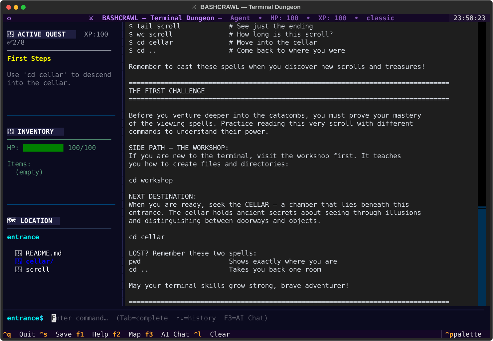

## 🎮 Getting Started

**Use the unified launcher:**

```bash
git clone https://github.com/bamr87/bashcrawl.git
cd bashcrawl
./setup.sh    # One-time setup
./main.sh     # Start your adventure
```

✨ **Features**: Simple setup • Multiple game modes • Safe sandbox • Real terminal commands

## 🌟 What Makes This Journey Special

- **Quest-Driven Learning**: Earn XP via guided quests with contextual hints
- **Real Terminal Skills**: Every command you learn applies to real-world development
- **Hidden Depths**: Secret areas and advanced features reward curious explorers
- **Multiple Paths**: Different routes through the catacombs teach different skills
- **Merlin Hint System**: Context-aware guidance when you're stuck

## 🚀 Quick Start Your Adventure

### Step 1: Get Bashcrawl

```bash
# Clone the repository (download a copy to your computer)
git clone https://github.com/bamr87/bashcrawl.git

# Navigate into the downloaded directory
cd bashcrawl
```

### Step 2: One-Time Setup

```bash
# Run the setup script (creates directories, sets permissions, initializes game)
./setup.sh
```

For development workflows (tests, viewer, MCP), install the Python package in editable mode:

```bash
python3 -m pip install -e ".[dev]"
```

### Static Web Version

Bashcrawl also ships a GitHub Pages-compatible browser build under `web/`.
It runs fully client-side with a TUI-inspired layout, local browser saves, and
in-game documentation.

```bash
make web-build      # regenerate web/data/*.json from game content
make web-test       # validate static assets and command parity
make web-preview    # preview at http://127.0.0.1:8000
```

The setup script will:
- Verify system requirements
- Create necessary directories and game state files
- Set up executable permissions for all game files
- Initialize the help system
- Verify installation

### Step 3: Start Your Adventure

```bash
# Launch the main game launcher
./main.sh

# Jump directly into the interactive emulator
./main.sh --interactive
```

Choose from multiple adventure modes:

#### 🎮 Textual TUI (Recommended for Beginners)

Rich terminal interface built with [Textual](https://textual.textualize.io/) (Python). Falls back to the classic bash emulator if Python is unavailable.

- **Safe Environment**: Cannot access or modify files outside the game
- **Built-in Help**: Context-aware assistance with `help` command
- **Game Integration**: Inventory, health, and progress tracking
- **Beginner-Friendly**: Guided experience with tutorials and hints
- **Real Commands**: Learn actual terminal commands in a safe space

#### 🖥️ Classic Bash Emulator

Pure-bash emulator — no Python required:

- **Lightweight**: Runs anywhere bash is available
- **Same Game Content**: Full dungeon, quests, and progression
- **Safe Sandbox**: Restricted to the game directory

#### 🖥️ Native Terminal Experience (For Experienced Users)

Use your actual terminal environment:

- **Full Access**: Uses your complete terminal environment
- **Traditional Experience**: Classic bashcrawl gameplay
- **Advanced Features**: Full bash/shell capabilities
- **Help System**: Optional context-aware assistance

#### 🎓 Tutorial & Learning Modes

- **Interactive Tutorial**: Learn the basics step-by-step
- **Demo Mode**: See examples of gameplay and features
- **Help Documentation**: Comprehensive guides and references

#### 🤖 Agent Mode (For AI Assistants)

Headless mode for programmatic interaction — lets AI coding assistants play the game
and capture SVG screenshots:

- **Textual TUI Agent**: Full visual rendering with automatic screenshots
- **Bash Agent REPL**: Lightweight fallback (no Python required)
- **`READY>` Protocol**: Line-buffered I/O with synchronization sentinels
- **SVG Screenshots**: Visual snapshots via Textual's `save_screenshot()`

See [docs/agent-protocol.md](docs/agent-protocol.md) for the full specification.

### 🚀 Launcher Commands Reference

Once you're set up, use these commands:

```bash
# Game launcher
./main.sh                    # Launch interactive menu
./main.sh --interactive      # Textual TUI (default interactive mode)
./main.sh --classic          # Classic bash emulator (no Python)
./main.sh --native           # Native terminal experience
./main.sh --tutorial         # Launch tutorial mode
./main.sh --demo             # Run demonstration mode

# Agent / automation
./main.sh --agent            # Agent mode (Textual TUI + screenshots)
./main.sh --agent-bash       # Agent mode (bash-only REPL, no Python)
./main.sh --screenshot-dir X # Set screenshot output directory
./main.sh --command "CMD"    # Run a single command and exit
./main.sh --batch            # Read commands from stdin

# Status & maintenance
./main.sh --status           # Show current game status
./main.sh --reset            # Reset game state
./main.sh --version          # Show version info
./main.sh --debug            # Enable debug logging
./main.sh --help             # View all options

# Setup
./setup.sh --verify          # Check installation
./setup.sh --repair          # Fix installation issues
./setup.sh --quick           # Quick setup (skip optional steps)
./setup.sh --health-check    # Run health diagnostics
./setup.sh --uninstall       # Remove game setup
```

#### 🔍 Understanding These Commands

**`git clone`** - Downloads a complete copy of the repository to your local machine

- Creates a new directory with the project name
- Downloads all files, folders, and version history
- Connects your local copy to the remote repository

**`cd bashcrawl`** - Changes your current directory (think of it as "entering a folder")

- `cd` stands for "change directory"
- Takes you inside the bashcrawl folder that was just created
- Your terminal prompt will update to show you're now in this location

**`cd entrance`** - Navigate to the starting area of the game

- Moves you into the "entrance" subdirectory
- This is where your adventure officially begins
- Think of it as walking through the dungeon's front door

**`cat scroll`** - Display the contents of the scroll file

- `cat` shows the entire contents of a text file
- "scroll" is the name of the file containing your first instructions
- This command reveals the game's opening narrative and your first challenges

#### 🛠️ Essential Terminal Basics Before You Begin

**Navigation Commands:**

```bash
pwd                 # Print Working Directory - shows exactly where you are
ls                  # List - shows all files and folders in current location
ls -la              # List with details - shows hidden files, permissions, dates
cd ..               # Go up one directory level (like clicking "back")
cd ~                # Go to your home directory
cd /                # Go to the root directory of your system
```

**File Viewing Commands:**

```bash
cat filename        # Display entire file contents at once
less filename       # View file contents page by page (press 'q' to quit)
head filename       # Show first 10 lines of a file
tail filename       # Show last 10 lines of a file
wc filename         # Word count - shows lines, words, and characters
```

**Getting Help:**

```bash
man command         # Manual page for any command (press 'q' to exit)
command --help      # Quick help for most commands
which command       # Shows where a command is located
history             # Shows your recent command history
```

**File and Directory Operations:**

```bash
mkdir dirname       # Create a new directory
touch filename      # Create a new empty file
cp source dest      # Copy file or directory
mv old new          # Move/rename file or directory
rm filename         # Delete a file (be careful!)
rmdir dirname       # Delete an empty directory
```

#### 🎯 Pro Tips for New Terminal Users

**Command Shortcuts:**

- **Tab Completion**: Press `Tab` to auto-complete file/directory names
- **Up Arrow**: Scroll through previous commands
- **Ctrl + C**: Stop a running command
- **Ctrl + L**: Clear the terminal screen (same as `clear` command)
- **Ctrl + A**: Jump to beginning of current line
- **Ctrl + E**: Jump to end of current line

**Safety First:**

- Always know where you are with `pwd` before running commands
- Use `ls` to see what's in a directory before acting
- Be extra careful with `rm` (delete) commands - there's no recycle bin!
- When in doubt, use `--help` or `man` to understand a command

### ☁️ Instant Play Online

Launch in your browser via Binder (no install required):

| Source | Launch |
|--------|--------|
| GitHub (primary) | [](https://mybinder.org/v2/gh/bamr87/bashcrawl/HEAD) |
| GitLab (upstream) | [](https://mybinder.org/v2/gl/nthiery%2Fbashcrawl/HEAD) |
| GitHub (this fork) | [](https://mybinder.org/v2/gh/bamr87/bashcrawl/HEAD) |

> **Note**: The Binder environments run the original upstream content. Features specific to this fork (Textual TUI, quest system, agent mode) require a local install.

## 🎬 Gameplay Screenshots

The following screenshots were captured from a live end-to-end TUI session using the built-in
agent mode (`./main.sh --agent`).  They show the core progression from the entrance all the way
through the chamber.

### 🚪 The Entrance — Know Thy Place (`pwd` & `ls`)

Awaken in the dungeon entrance and learn your first two spells: `pwd` to reveal your location
and `ls` to see what surrounds you.

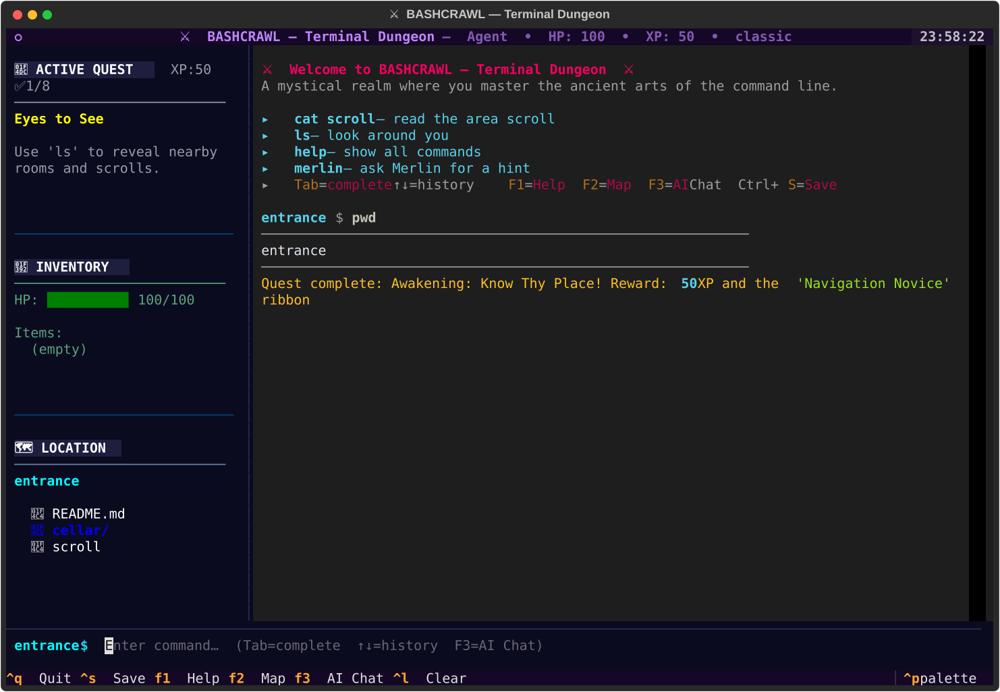

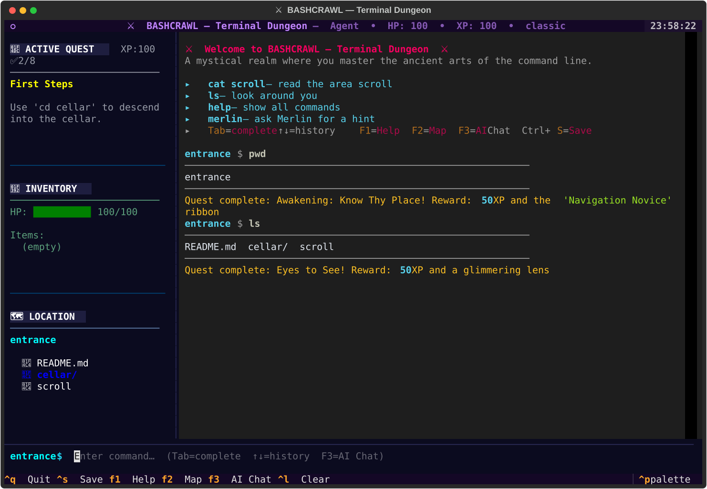

### 📜 Reading the Ancient Scroll (`cat scroll`)

Every room contains a `scroll` file packed with lore and instructions.  `cat scroll` is your
most-used spell throughout the adventure.


### 🏚️ Descending to the Cellar (`ls -F` & `./treasure`)

Move deeper with `cd cellar`, use `ls -F` to distinguish directories from executables, then run
`./treasure` to claim your first inventory item — the emerald amulet.

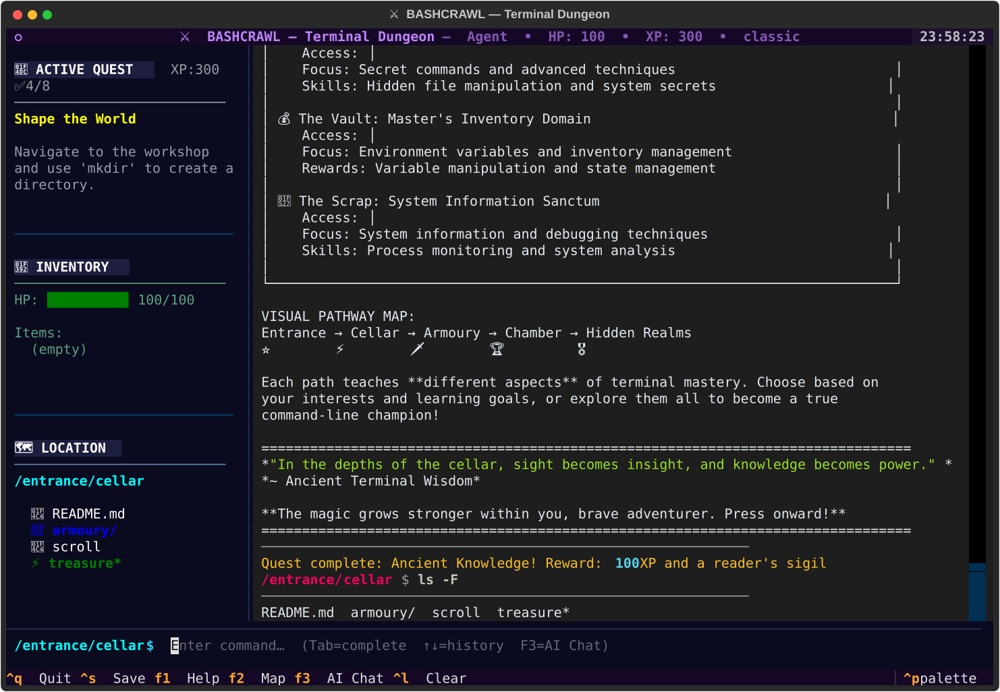

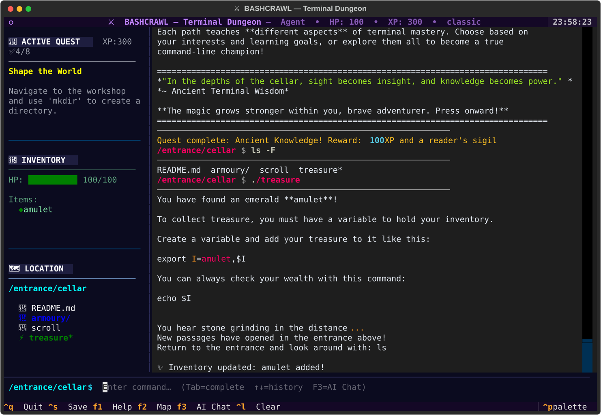

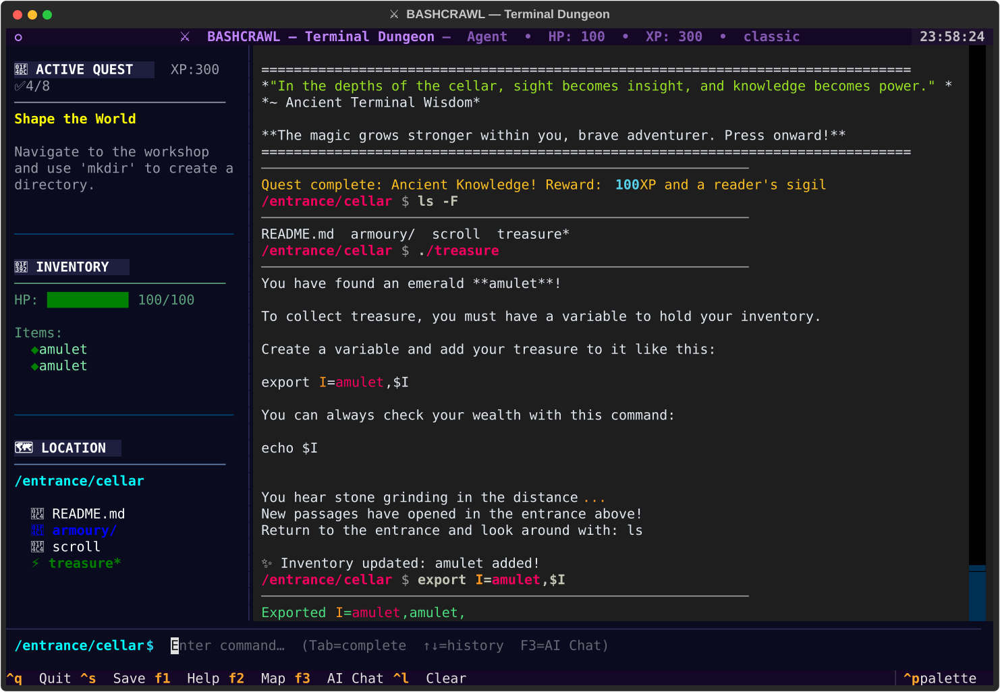

### 🗡️ The Armoury — Combat & Equipment

The armoury teaches file permissions and executable scripts.  Collect the sword, drink the
health potion, and prepare for battle.

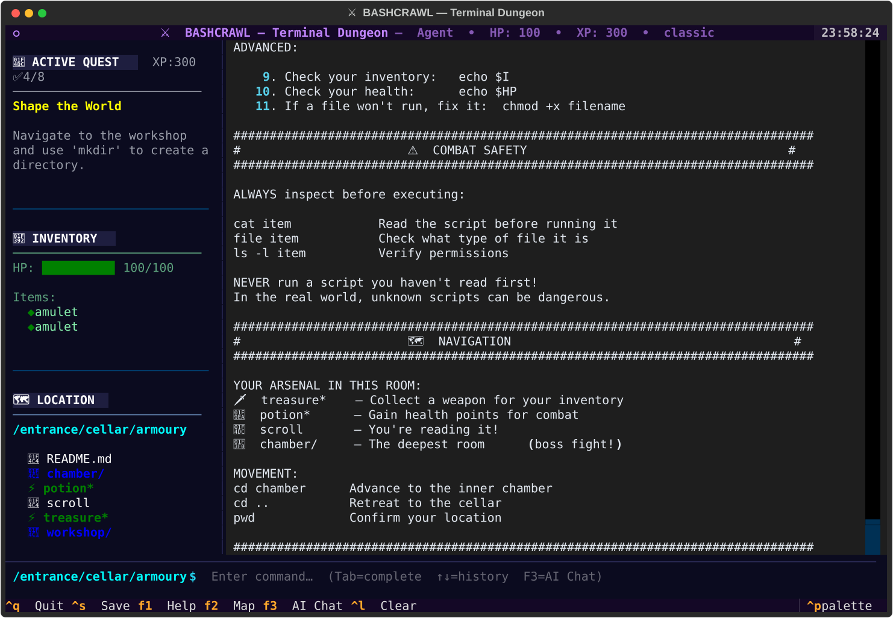

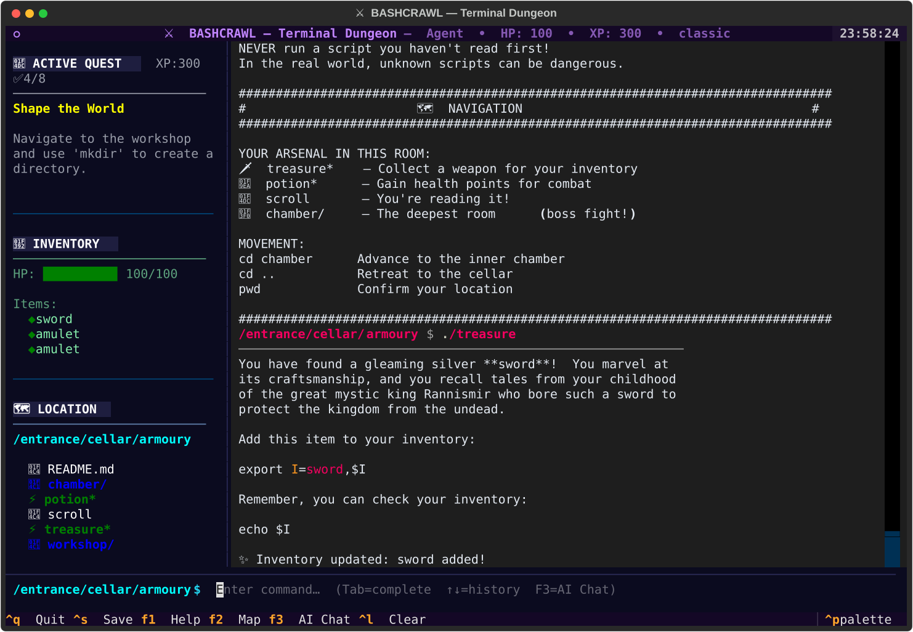

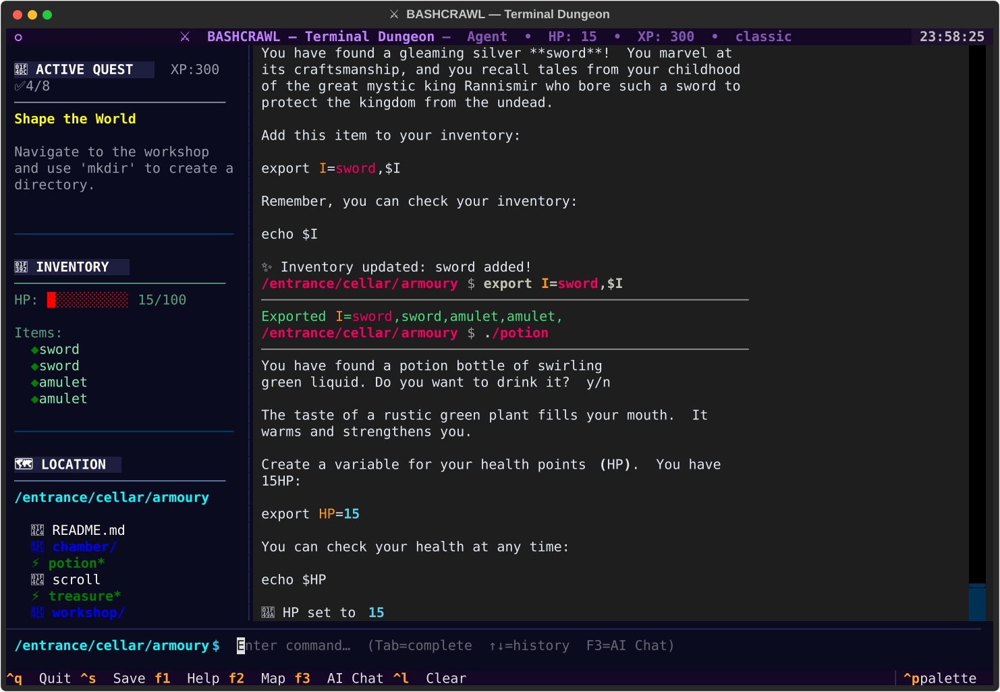

### 🏰 The Chamber — Boss Encounter

Face the statue in the innermost chamber.  Victory requires the sword you claimed in the
armoury and teaches arithmetic operators (`let`).

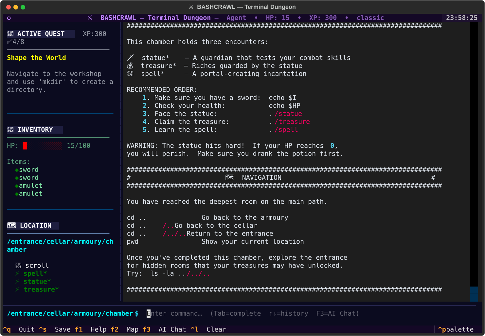

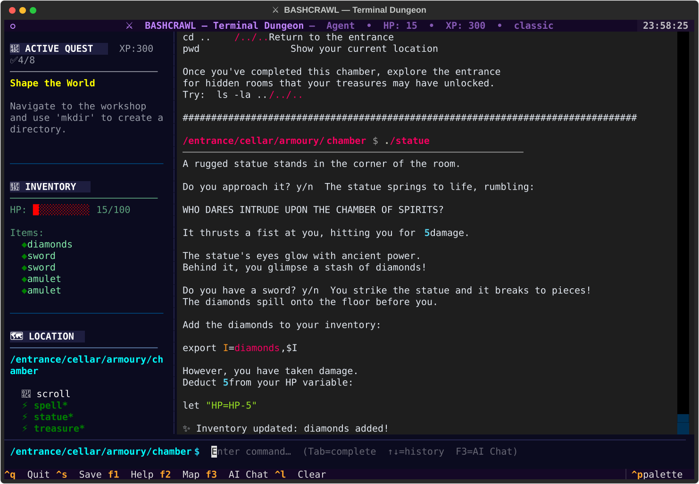

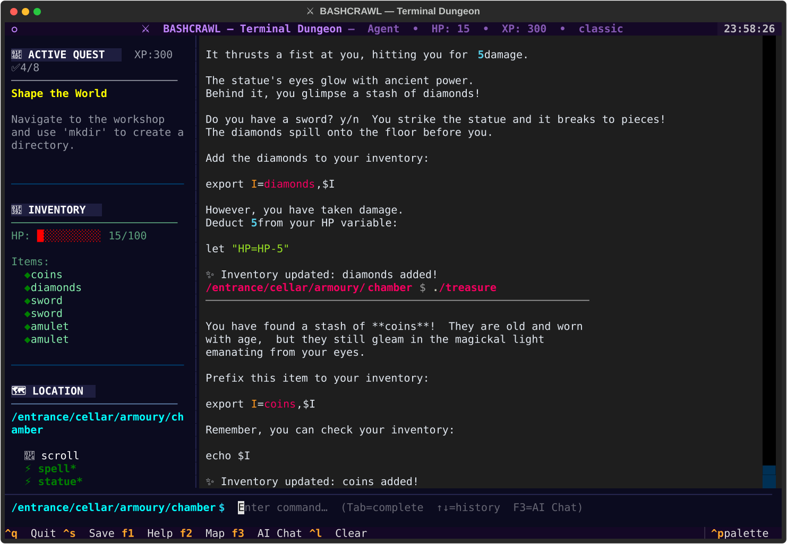

### 📊 Adventure Status & Quest Tracker

Use the built-in `status` and `quest` commands to see your collected inventory, health, XP, and
active objectives at any time.


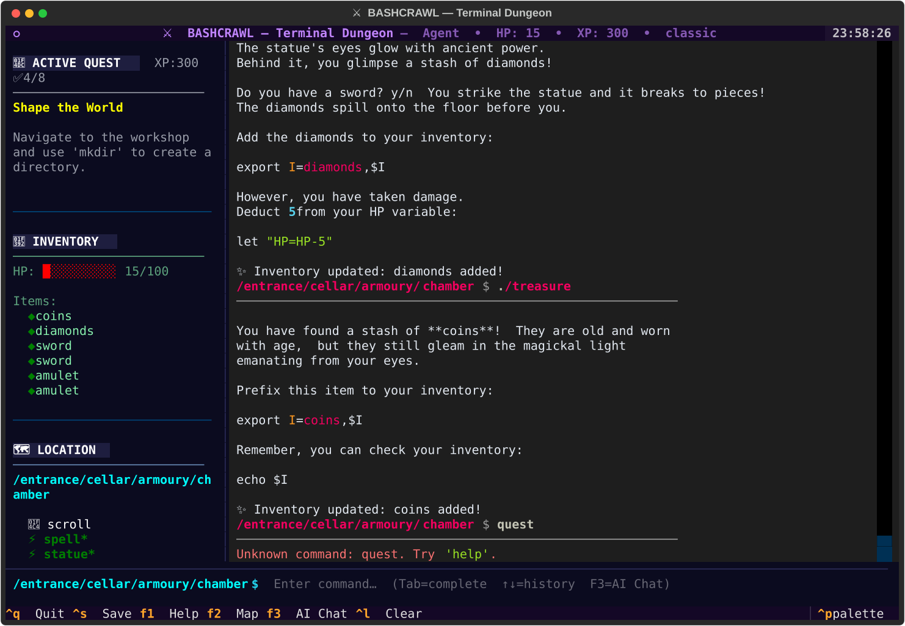

---

## 🛡️ Interactive Terminal Emulator

### 🎯 What Makes It Special

The Interactive Terminal Emulator provides a **safe, contained environment** that simulates a real terminal while keeping you within the game boundaries. Perfect for:

- **Absolute Beginners**: Learn without fear of breaking your system
- **Classroom Settings**: Safe environment for educational use  
- **Controlled Learning**: Focus on game commands without system distractions
- **Cross-Platform Consistency**: Same experience across different operating systems

### ✨ Key Features

**🔐 Safety First**
- Cannot access files outside the game directory
- No risk of accidentally deleting system files
- Sandboxed environment with restricted command set
- Perfect for learning without consequences

**🎮 Game Integration**
- Built-in inventory system (`inventory` command)
- Health tracking (`health` command)  
- Progress monitoring (`status` command)
- Interactive map (`map` command)
- Quest tracker with XP rewards (`quest` command)
- Merlin hint system for the next step (`merlin` command)
- Context-aware help system

**📚 Learning Support**
- Guided tutorial (`tutorial` command)
- Command reference (`commands` command)
- Context-specific help based on your location
- Step-by-step guidance for new players
- Quick saves and restores (`save` / `load` commands)

**🎨 Enhanced Experience**
- Colorized output and prompts
- Area-specific visual themes
- Progress indicators and status displays
- Command history and game state persistence

### 🚀 In-Game Commands Reference

```bash
# Essential navigation
ls          # Look around current area
cd <dir>    # Move to different area  
pwd         # Show current location

# Game status
status      # Complete adventure status
inventory   # Show collected items (alias: i)
health      # Show health points (alias: hp)
map         # Display catacombs map
quest       # Show current quest and objectives
merlin      # Receive a contextual hint
save        # Save your current progress
load        # Load your saved progress
reset       # Restart the adventure from scratch
exit        # Leave the emulator safely

# Learning support  
help        # Context-aware assistance
tutorial    # Interactive learning guide
commands    # Full command reference
start       # Begin/restart adventure

# File operations
cat <file>  # Read scrolls and documents
less <file> # Page through long content
touch <file> # Create or update a file
mkdir <dir>  # Create a new directory
grep <p> <f> # Search for words in scrolls
./treasure  # Interact with game elements
```

### 🧭 Quest & Progression System

- **`quest`** highlights your active objective, completed quests, and total XP.
- **`merlin`** delivers contextual hints tailored to your current quest step.
- **XP rewards** trigger automatically when required commands are used in the right place.
- **Auto-save** keeps progress between sessions; use **`save`** anytime and **`load`** to resume.
- **`reset`** wipes state clean so you can replay without touching project files.

These quests cover foundational commands (`pwd`, `ls`, `cd`, `mkdir`, `touch`, `cat`, `grep`) and ensure players practice each skill before graduating to the next challenge.

### 🎓 Educational Benefits

- **Progressive Learning**: Start with basic commands and gradually learn advanced techniques
- **Real Skills**: Every command works exactly like in actual terminals
- **Safe Practice**: Experiment freely without system consequences
- **Immediate Feedback**: Instant validation of commands and progress
- **Contextual Help**: Get assistance specific to your current situation

### 🍎 macOS Users: Special Instructions

macOS's default Archive Utility may incorrectly set file permissions when downloading a zip. Use `git clone` (recommended) or extract via the terminal:

```bash
# Option A: git clone (recommended)
git clone https://github.com/bamr87/bashcrawl.git && cd bashcrawl && ./setup.sh

# Option B: download and extract via terminal
curl -L https://github.com/bamr87/bashcrawl/archive/refs/heads/main.zip -o bashcrawl.zip
unzip bashcrawl.zip
cd bashcrawl-main
./setup.sh
```

## 🎯 Learning Path & Skills

### 🟢 Novice Terminal Skills

**What you'll master in the first areas:**

- File and directory navigation (`ls`, `cd`, `pwd`)
- Reading file contents (`cat`, `less`, `more`)
- Understanding file permissions and types
- Basic shell aliases and environment variables

### 🟡 Intermediate Command Mastery

**As you venture deeper:**

- File searching and pattern matching (`find`, `grep`)
- Process management and system information
- Advanced directory operations (`mkdir`, `rmdir`, `tree`)
- Shell scripting fundamentals and variables

### 🔴 Advanced Terminal Sorcery

**In the deepest dungeons:**

- Complex command chaining and pipes
- Regular expressions and text processing
- System monitoring and troubleshooting
- Custom function creation and automation

## 🤖 Intelligent Help System

Bashcrawl features an AI-enhanced, context-aware help system that adapts to your progress and provides intelligent assistance throughout your journey.

### ✨ Features

- **Context-Aware**: Adapts help content based on your current location in the dungeon
- **Progress-Aware**: Provides different guidance based on your experience level and inventory
- **AI-Enhanced**: Intelligent suggestions based on your game state and current situation
- **Location-Specific**: Tailored advice for each dungeon area with relevant commands
- **Interactive**: Responds to your inventory, health, and exploration progress

### Quick Activation

```bash
# Option 1: Run directly from project root
bash help.sh
bash help.sh commands    # Command quick reference
bash help.sh map         # Dungeon map

# Option 2: Enable as persistent shell function
source src/help/init_help.sh
help                     # Then use from any room
```

### Usage Examples

```bash
help                    # Context-aware help for current location
help commands           # Command quick reference card
help map                # Dungeon map showing all rooms
help reset              # How to reset the game
```

### 🧠 Smart Detection

The help system automatically detects and adapts to:
- Your current location in the dungeon
- Items in your inventory (`$I`)
- Your health points (`$HP`)
- Areas you've explored
- Available files and executables in your current area
- Your experience level (novice, intermediate, advanced)

### 📱 Sample Output

When you're in the entrance and type `help`, you'll see:
- Your current adventure status and progress
- Location-specific guidance for the entrance hall
- AI suggestions based on your experience level
- Smart tips for available files in your current area
- Universal terminal commands relevant to your situation
- Quick access to extended help topics

*The help system grows with you, providing basic guidance for newcomers and advanced tips for experienced terminal users!*

## 🗺️ The Catacombs: Complete Adventure Map

Your journey follows a carefully designed progression through interconnected chambers, each teaching essential terminal skills:

### 📍 **Phase 1: Foundation Chambers**

**🚪 ENTRANCE** (Starting Point)

- **Skills Learned**: Basic navigation (`ls`, `cd`, `pwd`) and comprehensive file viewing
- **Key Commands**: `cat`, `less`, `head`, `tail`, `wc`
- **Challenge**: Master all viewing spells before proceeding
- **Side Path**: Workshop (teaches `mkdir`, `touch`, `rm`, `cp`, `echo >`)
- **Next Step**: Descend to the Cellar

**🔧 THE WORKSHOP** (Creation & Destruction Tutorial)

- **Skills Learned**: File and directory creation, removal, and output redirection
- **Key Commands**: `mkdir`, `touch`, `rm`, `rmdir`, `echo >`, `>>`
- **Challenge**: Complete 5 progressive exercises
- **Special Features**: Side tutorial room — optional but recommended for beginners

**🏰 THE CELLAR**

- **Skills Learned**: Advanced listing with `ls -F`, shell aliases, distinguishing file types
- **Key Commands**: `ls -F`, `alias`, file type recognition
- **Challenge**: Learn to see through illusions and identify directories vs executables
- **Treasures**: Emerald amulet (inventory system introduction)
- **Next Steps**: Multiple paths unlock — Armoury, Chapel, Vault, or Scrap (symlinks)

### 📍 **Phase 2: Specialization Chambers**

**🗡️ THE ARMOURY** (Combat & File Manipulation)

- **Skills Learned**: File operations, permissions, executable scripts
- **Key Commands**: `chmod`, `./script`, file manipulation
- **Challenge**: Master combat mechanics and file permissions
- **Special Features**: Weapon collection, combat system
- **Leads To**: Advanced combat chambers

**⛪ HIDDEN CHAPEL** (Secret Commands & Advanced Techniques)

- **Skills Learned**: Hidden commands, advanced shell features
- **Key Commands**: Hidden/advanced shell operations
- **Challenge**: Discover secret passages and easter eggs
- **Special Features**: Unlocked only after collecting treasures
- **Sub-Areas**: Courtyard → Aviary → Hall (monster encounter) → Library (tome)
- **Graveyard**: Columbarium, Royal Tombs, Lower Quadrant, and hidden Mausoleum
- **Leads To**: Deep exploration and combat challenges

**💰 THE VAULT** (Data Management & Variables)

- **Skills Learned**: Environment variables, data storage, inventory management
- **Key Commands**: `export`, `echo $VAR`, variable manipulation
- **Challenge**: Master the inventory and wealth systems
- **Special Features**: Stronghold with goblet (unlocks the Rift), orb collection
- **Sub-Areas**: Stronghold → Nursery → Lab (ghost encounter)
- **Leads To**: The Rift (via goblet in the Stronghold)

**🔧 THE SCRAP** (Symlinks & Portals)

- **Skills Learned**: Symbolic links, file shortcuts, portal creation
- **Key Commands**: `ln -s`, `ls -l`, `readlink`
- **Challenge**: Create a portal to the hidden Rift
- **Special Features**: Teaches symlink navigation
- **Leads To**: The Rift (advanced challenges)

### 📍 **Phase 3: Mastery Chambers**

**🌀 THE RIFT** (Advanced Challenges — unlocked via Vault's Goblet)

- **Skills Learned**: Complex command chaining, pipes, advanced scripting
- **Key Commands**: Complex pipelines, advanced bash scripting
- **Sub-Areas**:
  - **Arena → Pit**: Boss encounters (Nyarlathotep, Drummer), end-game treasure
  - **Spire → Mezzanine**: Hidden elevator leading to a secret satellite station
- **Special Features**: Deep nested hidden rooms reward thorough exploration

**📚 THE LIBRARY** (Documentation & Lore)

- **Location**: Deep within the Chapel path (`.chapel/courtyard/aviary/hall/library/`)
- **Skills Learned**: Reading documentation, using `man` pages, self-directed learning
- **Key Commands**: `man`, `info`, `--help`, documentation tools
- **Special Features**: Contains the ancient tome — meta-learning and exploration

### 🎯 **Skill Progression Path**

```text
ENTRANCE (File Viewing)
    ├── workshop/ (mkdir, touch, rm, echo >) — side tutorial
    └── cellar/ (File Types & Aliases)
         └── armoury/ (Permissions/Combat)
              └── chamber/ (Variables/Scripting)

[Hidden rooms unlocked by treasures]
    ├── .chapel/ → courtyard → aviary → hall (Monster) → library
    │              └── graveyard → columbarium, royal-tombs, .mausoleum
    ├── .vault/ → stronghold (Goblet) → nursery → lab (Ghost)
    ├── .scrap/ (Symlinks/Portals)
    └── .rift/ (unlocked via Vault) → arena → pit (Boss Encounters)
                                    → spire → mezzanine → .elevator → .satellite
```

### 🔄 **Interconnected Network**

The catacombs form a living network where:

- **Multiple Entry Points**: Some chambers can be reached via different paths
- **Skill Dependencies**: Certain areas require mastery from previous chambers
- **Secret Passages**: Hidden connections reward thorough exploration
- **Backtracking Rewards**: Returning to earlier areas with new skills unlocks secrets
- **Cross-Chamber Challenges**: Some puzzles require knowledge from multiple areas

### 🏆 **Mastery Indicators**

- **Treasure Collection**: Each chamber contains unique treasures validating skill mastery
- **Command Proficiency**: Successful completion of chamber-specific challenges
- **Secret Discovery**: Finding hidden areas and easter eggs
- **Real-World Application**: Successfully applying learned skills outside the game

## 🎮 Gameplay Mechanics

### 💰 Inventory System

Collect items and manage your adventure gear:

```bash
# Check your current inventory
echo $I

# Add items to your collection  
export I=sword,amulet,coins,$I
```

### ⚡ Health & Combat

Survive encounters with system challenges:

```bash
# Monitor your health points
echo $HP

# Recover from battles
let "HP=HP+5"
```

### 🔍 Exploration Commands

Essential spells for navigation:

```bash
ls -F        # See all items with type indicators
cd <room>    # Move between chambers
cat scroll   # Read instructions and lore
pwd          # Know your exact location
```

## ⚔️ Advanced Features

### 🔮 Hidden Rooms

Collect treasures to unlock secret areas:

- **Chapel** — Altar, courtyard, aviary, graveyard (with hidden mausoleum), and the deep library
- **Vault** — Stronghold with goblet and orb, nursery, and lab (ghost encounter)
- **Scrap** — Symlinks and portal creation (`ln -s`)
- **Rift** — Arena pit (boss encounters), spire, and hidden elevator to satellite station (unlocked via Vault's goblet)

### 🎲 Combat System

Battle encounters teach arithmetic and variable manipulation:

```bash
./statue      # Combat in the Chamber
./monster     # Battle in the Aviary Hall
./ghost       # Encounter in the Vault's Lab
./goblet      # Challenge in the Vault's Stronghold (unlocks the Rift)
```

### 📜 Enhanced Scroll Rendering

For richer scroll display, install [glow](https://github.com/charmbracelet/glow):

```bash
brew install glow     # macOS
glow scroll           # Rendered markdown view
```

> For terminal themes, dashboards, and other power-ups, see [docs/advanced.md](docs/advanced.md).

## 🔄 Starting Fresh

Reset your adventure for practice or sharing:

```bash
# Method 1: Use the built-in reset script
bash lib/reset.sh              # Execute reset
bash lib/reset.sh --dry        # Preview what will be reset first

# Method 2: Reset via the launcher
./main.sh --reset

# Method 3: Reset inventory and health manually
unset I HP
cd entrance

# Method 4: Clean restart (re-clone)
rm -rf bashcrawl
git clone https://github.com/bamr87/bashcrawl.git
```

## 🌐 Community & Learning Resources

### 🤝 Join the Adventure

- **Upstream**: [GitLab — slackermedia/bashcrawl](https://gitlab.com/slackermedia/bashcrawl) (original project)
- **This fork**: [GitHub — bamr87/bashcrawl](https://github.com/bamr87/bashcrawl)
- **Bug reports**: [Open an issue](https://github.com/bamr87/bashcrawl/issues)
- **Contributions**: Submit new rooms, puzzles, or features via pull request
- **Community**: Share your achievements and learn from others

### 📚 Extended Learning

Bashcrawl connects to broader terminal education:

- **IT-Journey.dev**: Progressive quests and skill-building
- **Command Line Tutorials**: Structured learning paths
- **Real-World Projects**: Apply skills to actual development tasks
- **Advanced Challenges**: Graduate to system administration and DevOps

### 🎖️ For Educators

Perfect for computer science education:

- **Classroom Integration**: Engaging way to teach command-line basics
- **Progress Tracking**: Monitor student advancement through areas
- **Customizable Content**: Add institution-specific challenges
- **Assessment Tools**: Validate learning through gameplay completion

---

**Ready to begin your transformation from GUI dependent to command-line champion?**

```bash
cd entrance && cat scroll
```

*Adventure awaits, brave terminal warrior. The catacombs test not just your memory of commands,
but your ability to think like the system itself. May your paths be swift, your permissions
correct, and your exit codes always zero.*

**Happy Hacking!** ⚡

<!-- 

## 🔮 For Those Who Seek to Transcend Mortal Limitations

*"In shadows deep, where none dare tread,  
Lies knowledge vast for those with dread.  
The path is hidden, dark and steep,  
For terminal souls who secrets keep."*

### 🗝️ The Riddle of the Ancient Codex

Brave warrior, legends speak of an **Ancient Codex of Terminal Mastery** hidden within these very catacombs. Only those who possess the wisdom to look beyond the visible realm can hope to discover its location.

The ancient prophecy speaks thus:

```
🔍 "Seek ye the file that starts with naught but dot,
    Where 'ancient' and 'codex' in the name are caught.
    In the realm's very root, it lies concealed,
    To those who know how hidden truths are revealed."

📜 "When found, invoke its power with the shell,
    And witness secrets that few can tell.
    But know this, seeker of forbidden lore:
    Only the worthy shall unlock this door."

⚔️ "The path requires no complex art,
    Just knowledge of how hidden files start.
    Execute with bash what you discover there,
    And ascend beyond what mortals dare."
```

### 🎯 Cryptic Hints for the Initiated

For those whose terminal mastery runs deep, these whispered clues may guide your quest:

- **The Hidden Sight**: *"What flag reveals the concealed to mortal eyes?"*
- **The Ancient Name**: *"Where terminal mastery meets the codex of old..."*
- **The Invocation**: *"The shell shall be your key, the script your gateway..."*
- **The Location**: *"Not in depths below, but in the realm's foundation..."*

### 🏆 The Worthiness Test

Only those who can answer these challenges may be ready for the Codex:

1. **Shadow Walker**: Can you list files that begin with darkness itself?
2. **Pattern Seeker**: Do you know the incantation to find files by name?
3. **Ancient Invoker**: Can you breathe life into executable scrolls?
4. **Root Explorer**: Do you understand the difference between relative and absolute paths?

### 💫 What Awaits the Worthy

Those who successfully uncover and invoke the Ancient Codex will gain:

- **🎮 Divine Dashboard Powers**: Interface enhancements beyond mortal comprehension
- **📜 Sacred Markdown Rendering**: The ability to see text as the gods intended
- **🎨 Reality-Bending Themes**: Visual control over the very fabric of the terminal
- **⚡ Enhanced Navigation Sorcery**: Movement through directories like wind through leaves
- **🎵 Ambient Realm Control**: Command over the atmosphere itself
- **🚀 Ascension Protocols**: Knowledge that transforms terminal users into terminal deities

### 🌟 A Message to Future Terminal Gods

*If you successfully discover the Ancient Codex, you have proven yourself worthy of knowledge that spans the ages. Use this power wisely, and remember: true mastery comes not from hoarding knowledge, but from guiding others along the path to enlightenment.*

*May your commands be swift, your permissions be correct, and your exit codes always be zero.*

---

**🔮 The path to transcendence lies before you. Will you take the first step into shadow?**

 -->