# Hidden Gem — DAEMON STORM

A secret pixel shooter inside the TermForge HUD. It is **not** a listed command, does **not** appear in `help` / `commands`, and is **not** in the web arcade. HUD-mode `host-tty.js` only (`make tty-demo`). Zero dependencies: the whole thing is `termforge/node/gem.js` on top of a 350-line pixel canvas.

Rogue processes descend on the shell in formation. You are the prompt. Every shot is a signal.

## How to open it

```bash
make tty-demo
```

Then either:

| Unlock | What to do |
|---|---|
| `xyzzy` or `plugh` | Type the word and press Enter. Classic Adventure incantations; intercepted **before** the shell runs them, so they never hit `runtime.js` or the history. |
| Konami | `↑ ↑ ↓ ↓ ← → ← → b a` while the HUD input row is focused. |

`q` or `^C` returns to the dungeon at any point. `^D` still exits the TTY host. `--no-hud` / piped stdin never start the overlay (the words fall through as unknown commands). Terminals narrower than 60 columns or shorter than 14 rows get a size hint instead of a game.

## How the pixels work

A terminal cell is two vertically stacked pixels. The upper half block `▀` paints them independently: foreground = top pixel, background = bottom pixel, both 24-bit. A 100×30 terminal becomes a **100×56 framebuffer** with roughly square pixels — sprites, particles, a 3×5 pixel font, shields that erode pixel by pixel, screen shake, and CRT scanlines, all in plain ANSI. `pixels.js` owns that: `PixelBuffer` (set/rect/sprite/text/blit/add/scanlines) and `PixelScreen`, which encodes each cell row as SGR runs (`▀`, `▄`, `█`, or a bare space for black) and rewrites only the rows that changed since the last frame. A busy frame at 100×30 is about 8 KB; a quiet one, a few hundred bytes.

The status bar (row 1) and the help row (last row) stay ordinary text, so the terminal feel never breaks: `DAEMON STORM │ wave 1/3 SIGHUP │ pids 250 │ shells $$. │ nice 5s`.

## The rules

| Glyph | Thing | Rule |
|---|---|---|
| green caret | you, the prompt | `←` `→` (or `a` `d`, `h` `l`) move; a tap nudges one pixel, holding the key (auto-repeat) glides. `space` / `↑` / `k` / `w` fire. Two signals in flight at most. |
| `Z` (violet) | zombie | Top row. 30 pids. |
| crab (orange) | daemon | Middle rows, the bulk of every wave. 20 pids. Sometimes drops a power-up. |
| ring (magenta) | fork | Bottom row from wave 2. 40 pids — but it is a **fork bomb**: killing one spawns two forklets (10 pids each) that leave the formation, bounce between the walls and drift down on their own. |
| `S` box (gold) | `sudo` | Triple shot for 7 s. The prompt turns gold. |
| `N` box (blue) | `nice` | The whole storm runs at half speed for 7 s. |
| green blocks | firewalls | Four shields (three below 96 columns). Bullets, bolts and enemies chew through them pixel by pixel. |

The formation slides sideways, drops three pixels each time it hits a wall, and speeds up as it thins — the classic curve. The bottom-most process in each column fires red bolts. A bolt on the prompt is a **segmentation fault**: white flash, screen shake, one shell gone, a 1.4 s respawn with 1.6 s of blinking invulnerability. If the storm reaches the prompt's row it also costs a shell and is shoved back up. Three shells and it is **KERNEL PANIC**.

Waves are signals: **SIGHUP** (3 rows), **SIGINT** (4 rows, forks arrive), **SIGKILL** (5 rows, faster, more fire). Clearing a wave banks `100 × wave + 50 × shells left` pids. Clear all three and the screen reads **SYSTEM RESTORED**.

## Reward

The dungeon pays for progress, not persistence:

| Outcome | XP | Item |
|---|---|---|
| each wave cleared beyond your session best | +20 | — |
| first win (all three waves) | +40 on top | `kill_switch` |
| replaying without getting further | nothing | — |

Flags: `flags.daemon_storm_waves` (best wave count), `flags.daemon_storm` (won). A loss after clearing new waves still pays for those waves; the item only drops once. On the way back the HUD prints the tally (`pids reaped, kills, signals`) and toasts the XP, the item and any rank change.

## Effects

All effects are pure state read by the painter; the host owns the 50 ms timer.

| Effect | What you see |
|---|---|
| Starfield | two parallax layers drifting down behind everything |
| Bullet trails | four fading pixels behind each signal, a faint cyan halo beside the head |
| Explosions | 10–26 additive particles with drag and a little gravity, tinted by what died |
| Segfault | one-frame white flash, 0.35 s of shake (the whole field jitters up to ±2 px) |
| Power-up pulse | drops blink; pickup throws a coloured burst |
| Scanlines | odd pixel rows dimmed to 82 %; `c` toggles them |
| Banners | pixel-font `WAVE n` / `KILL -HUP INCOMING`, `SEGMENTATION FAULT`, `WAVE n CLEARED`, `SYSTEM RESTORED` (with fireworks), `KERNEL PANIC` |

The dungeon HUD keeps its own FX hook: a **damage** event jolts the whole TUI frame sideways for a few frames (`TuiScreen.setJolt`, stepped `2 → 0 → 1 → 0` by the host).

## Determinism

The world runs at a fixed 50 ms tick with a seeded `mulberry32` RNG, so a run is a pure function of `(seed, cols, rows, key events)`. `BASHCRAWL_GEM_SEED` pins a live session; tests and the capture tool use seed 42. `session.cheat()` (killAll / killAt / hit / bolt / drop / formationY) and `snapshot()` / `enemyList()` / `boltList()` are the test hooks.

## Files

| Path | Role |
|---|---|
| `termforge/node/pixels.js` | `PixelBuffer`, `PixelScreen`, `encodeRow`, `FONT3x5` |
| `termforge/node/gem.js` | the game: rules, simulation, painter, unlock helpers, reward |
| `termforge/node/host-tty.js` | HUD intercept (`xyzzy` / Konami), drops stale toasts, seeds from `BASHCRAWL_GEM_SEED`, tally + reward on return, damage jolt |
| `termforge/node/tui.js` | `setJolt()` horizontal frame offset |
| `termforge/core/input.js` | CSI `←`/`→` emit `{ type: "arrow", dir }` (up/down stay history) |
| `termforge/test/pixels.test.js` | canvas, font, encoder, row diffing |
| `termforge/test/gem.test.js` | unlock, determinism, movement, firing, kills, fork bombs, hits, overrun, power-ups, waves, reward |
| `test/integration/test_tty_host.py` | drives `host-tty.js` on a real PTY (boot, commands, `xyzzy`, start a wave, `q`, `^C`, `^D`); part of `make test` |
| `termforge/test/tools/capture-gem.js` | headless replay + PNG rasterizer; `--tty-raw` decodes a live byte stream (not CI) |

## Live run (this capture)

`node termforge/test/tools/capture-gem.js --tty-raw run3.raw --tty-size 100x30` replays seed 42 at 100×30 with a dodging autoplayer plus cheats for the rare states, then decodes the last frame of a real PTY session (`host-tty.js --app bashcrawl` under `pty.fork`, `xyzzy`, space, 12 s of key spam, `q`).

| Check | Result |
|---|---|
| Field | 100×56 pixels; 8 columns × 3 rows in SIGHUP (24 processes), 4 shields |
| First contact | 200 pids after 60 ticks of autoplay, shields already pitted |
| Segfault | cheat hit: `shells $$.`, respawn, blinking invulnerability |
| sudo | drop falls onto the prompt: gold ship, three signals per shot |
| Fork bomb | first fork killed in SIGINT: enemies 32 → 33, two forklets `free` |
| Victory | `{ won: true, waves: 3, score: 3830, kills: 128, shots: 29, reason: "win" }` |
| Reward | `{ granted: true, xp: 100, item: "kill_switch", waves: 3, firstWin: true }` → xp `12 → 112`, inventory `[amulet, kill_switch]`; a second grant is refused |
| Loss | three cheat hits in SIGHUP: `{ won: false, waves: 0, reason: "lost" }`, no pay |
| Live PTY | 2.35 MB for the whole session (~180 KB/s during play at 20 fps); the decoded final frame reads `shells $..  │  nice 5s` — the spammer picked up a `nice` and lost two shells; back in the HUD: `The storm fades. The dungeon waits. (250 pids reaped, no prize)` |

### 1. Title

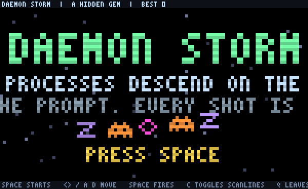

Pixel-font logo, a demo formation bobbing on a sine, blinking `PRESS SPACE`, two layers of stars.

### 2. Wave banner

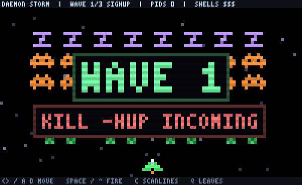

`WAVE 1` / `KILL -HUP INCOMING`. Formation and firewalls are already in place.

### 3. First contact

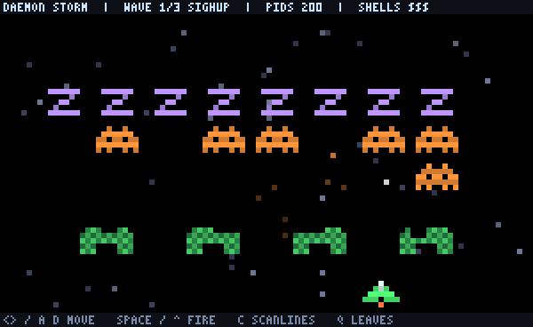

Bullets with trails, an explosion, bolts landing on the shields.

### 4. Mid-wave

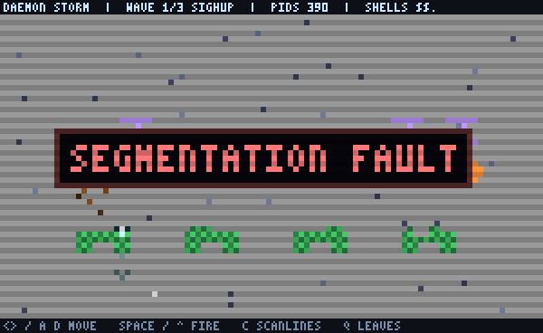

Thinned formation moving faster; pitted shields.

### 5. Segmentation fault

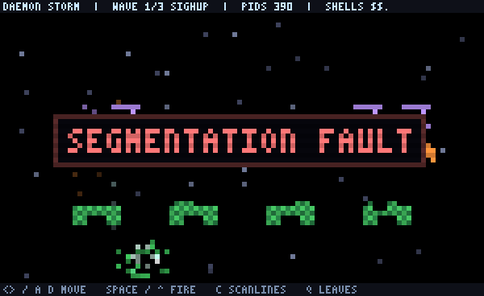

White flash fading, shake, one shell lost.

### 6. sudo

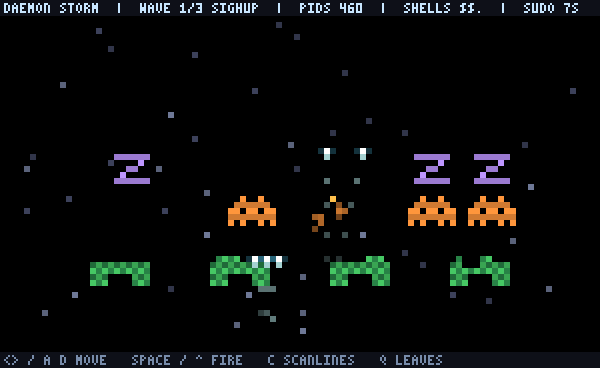

Gold prompt, triple spread.

### 7. Wave cleared

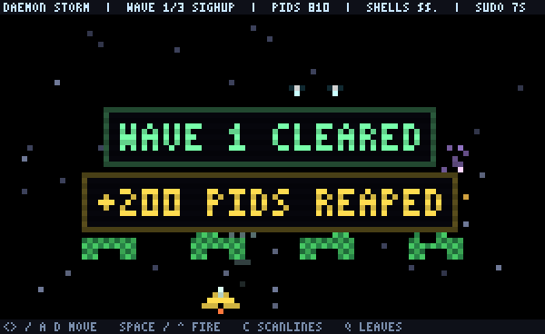

### 8. Fork bomb

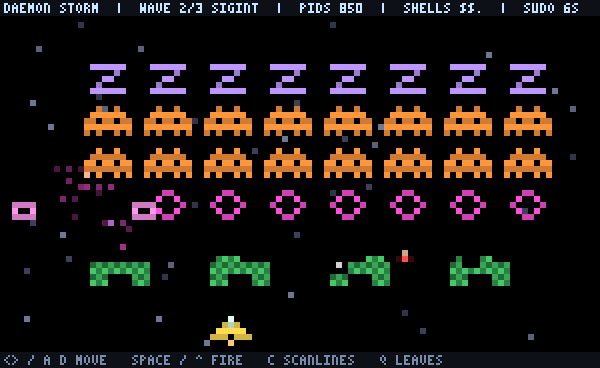

A fork dies in SIGINT and two forklets break formation.

### 9. System restored

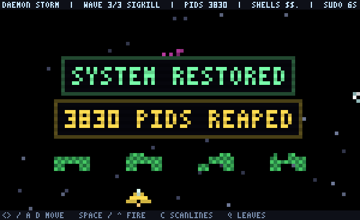

### 10. Kernel panic

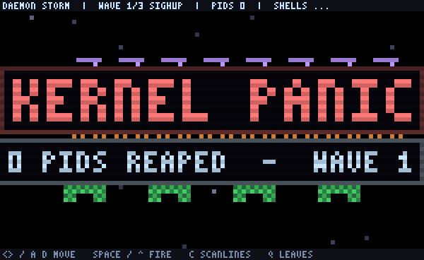

### 11. Live TTY

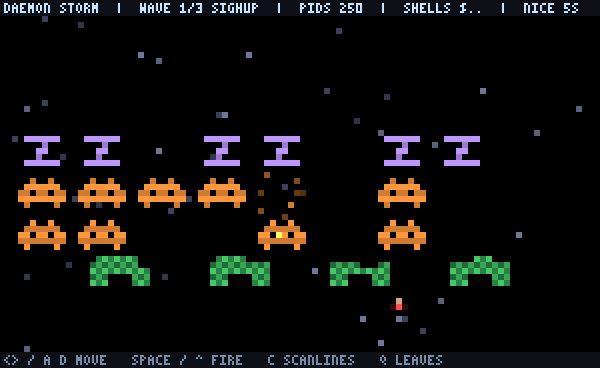

The final frame decoded straight from the PTY byte stream — the same half-block cells the terminal drew.

## Recapture

```bash
node termforge/test/tools/capture-gem.js                                   # replay shots only
node termforge/test/tools/capture-gem.js --tty-raw FILE --tty-size 100x30  # + a live frame
node --test termforge/test/pixels.test.js termforge/test/gem.test.js
make test   # includes test/integration/test_tty_host.py (needs node)
```

PNGs land in `docs/termforge/gem/`. `sips` (macOS) converts the intermediate PPM. The capture tool is a maintainer script, not a CI gate.
