# Bashcrawl: Complete Walkthrough

> A comprehensive guide to the Bashcrawl terminal adventure game.
> Learn real UNIX commands by exploring mystical catacombs, solving puzzles,
> and defeating monsters — all from the command line.

---

## Table of Contents

1. [Getting Started](#getting-started)
2. [The Seven Quests](#the-seven-quests)
3. [Path 1: The Cellar — Sight and Combat](#path-1-the-cellar--sight-and-combat)
4. [Path 2: The Chapel — Hidden Rooms and Exploration](#path-2-the-chapel--hidden-rooms-and-exploration)
5. [Path 3: The Graveyard — Secrets and Discovery](#path-3-the-graveyard--secrets-and-discovery)
6. [Path 4: The Vault — Memory and Variables](#path-4-the-vault--memory-and-variables)
7. [Path 5: The Scrap — Symlinks and Portals](#path-5-the-scrap--symlinks-and-portals)
8. [Path 6: The Rift — Endgame](#path-6-the-rift--endgame)
9. [Command Reference](#command-reference)
10. [Dungeon Map](#dungeon-map)

---

## Getting Started

Launch the game using the main launcher:

```bash
./main.sh                    # Interactive menu
./main.sh --interactive      # Textual TUI (recommended)
./main.sh --classic          # Bash terminal emulator
./main.sh --agent            # Agent mode with SVG screenshots
```

When the game starts, you are placed in the **bashcrawl lobby** — the root directory of the game world. Every directory is a room. Every file is an object. Every executable is an encounter.

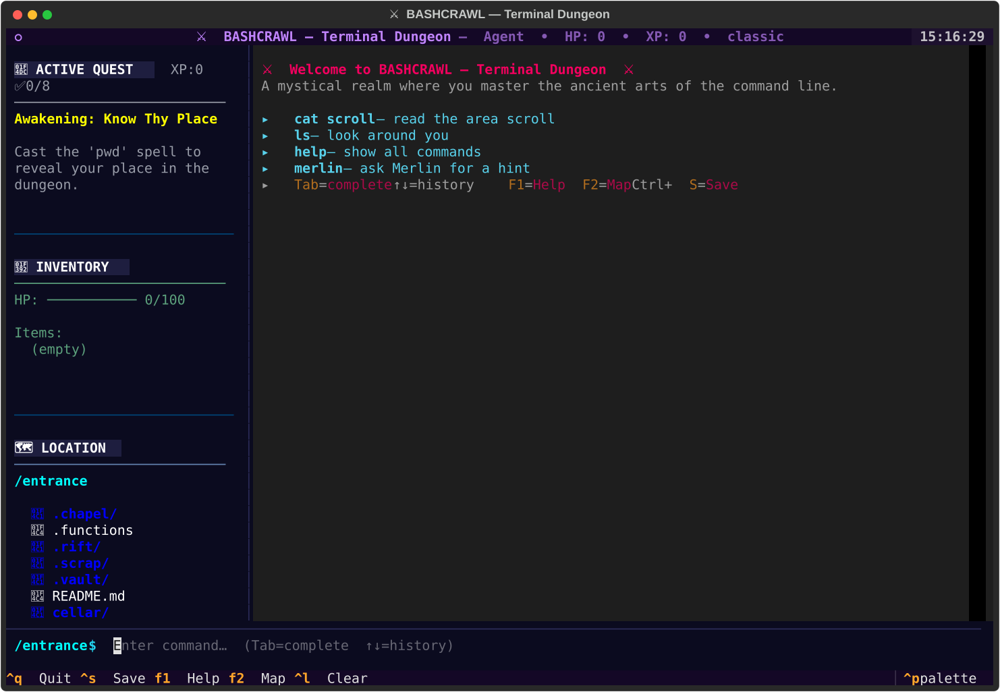

---

## The Seven Quests

Bashcrawl's tutorial system guides new players through seven progressive quests, each teaching a fundamental terminal command.

### Quest 1: Awakening — `pwd`

**Objective:** Cast the `pwd` spell to learn where you stand.

```bash
pwd
```

**What it does:** `pwd` stands for "**p**rint **w**orking **d**irectory." It shows the full path to your current location in the filesystem.

**Real-world use:** When you open a terminal and aren't sure where you are, `pwd` tells you immediately. Essential when writing scripts, navigating deep directory trees, or debugging path issues.

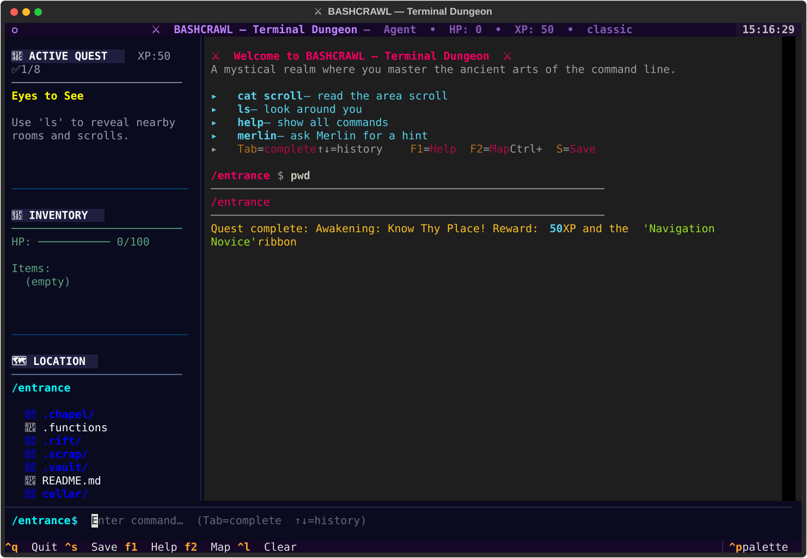

**Reward:** Navigation Novice ribbon (+50 XP)

---

### Quest 2: Eyes to See — `ls`

**Objective:** Use `ls` to reveal what surrounds you.

```bash
ls
```

**What it does:** `ls` **l**i**s**ts the contents of the current directory — files, folders, and everything visible in this "room."

**Real-world use:** The first command you run in any new directory. Pair it with flags like `-a` (show hidden files), `-l` (detailed view), or `-F` (show file types) for deeper inspection.

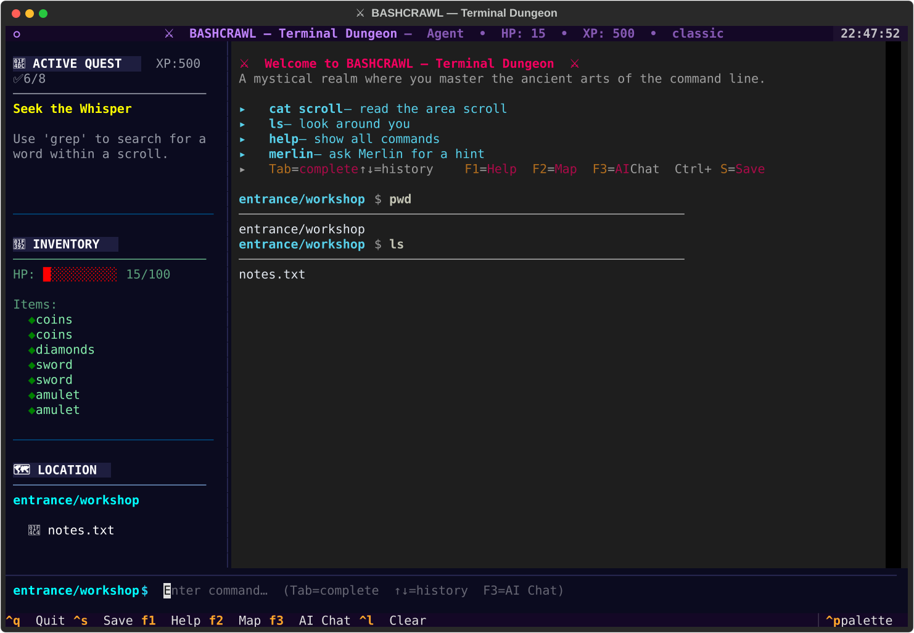

**Reward:** Glimmering lens (+50 XP)

---

### Quest 3: First Steps — `cd`

**Objective:** Travel to the entrance with `cd entrance`.

```bash
cd entrance
```

**What it does:** `cd` **c**hanges **d**irectory — it moves you from one room to another. `cd ..` goes back one level, `cd ~` goes home.

**Real-world use:** The primary navigation command in every terminal session. Used thousands of times a day by developers, sysadmins, and anyone working in a shell.

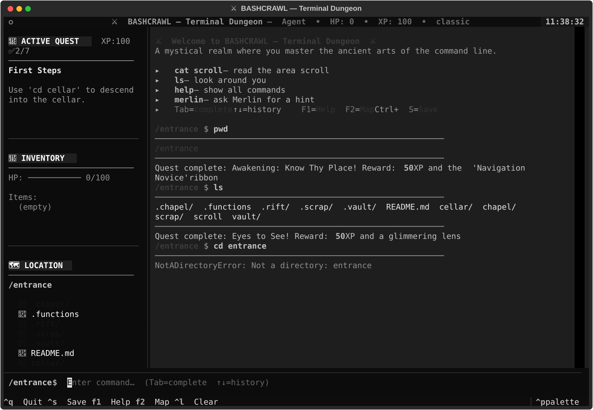

**Reward:** Pathwalker's charm (+100 XP)

---

### Quest 4: Shape the World — `mkdir`

**Objective:** Create a new space by running `mkdir workshop` while in the entrance.

```bash
mkdir workshop
```

**What it does:** `mkdir` **m**a**k**es a new **dir**ectory. Use `mkdir -p path/to/nested` to create intermediate directories.

**Real-world use:** Organizing projects, creating build output directories, setting up folder structures for new applications.

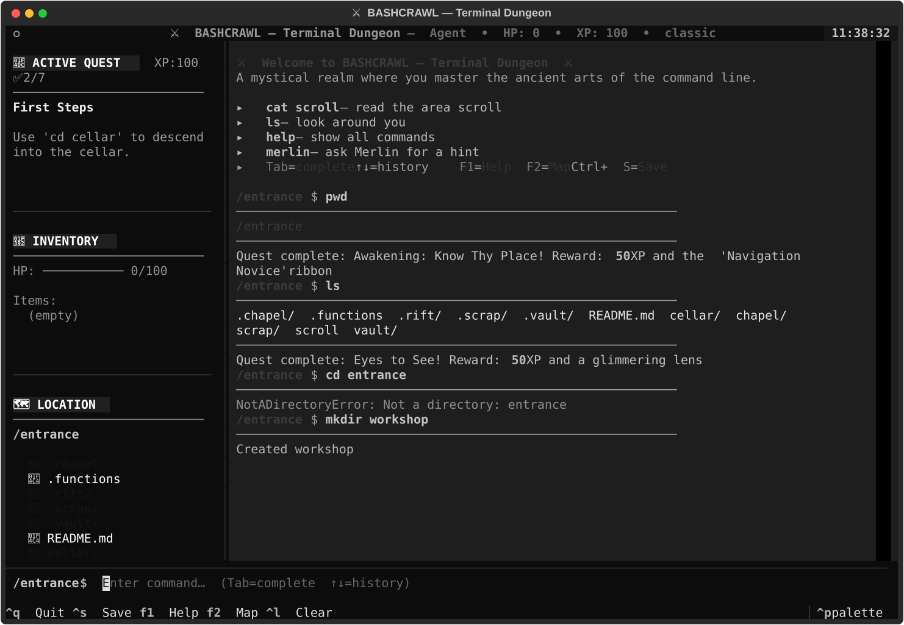

**Reward:** Builder's sigil (+100 XP)

---

### Quest 5: Spark of Creation — `touch`

**Objective:** Enter the workshop and conjure `notes.txt` with `touch notes.txt`.

```bash
cd workshop
touch notes.txt
```

**What it does:** `touch` creates an empty file (or updates the timestamp of an existing file).

**Real-world use:** Creating placeholder files, updating timestamps for build systems, creating lock files, initializing empty configuration files.

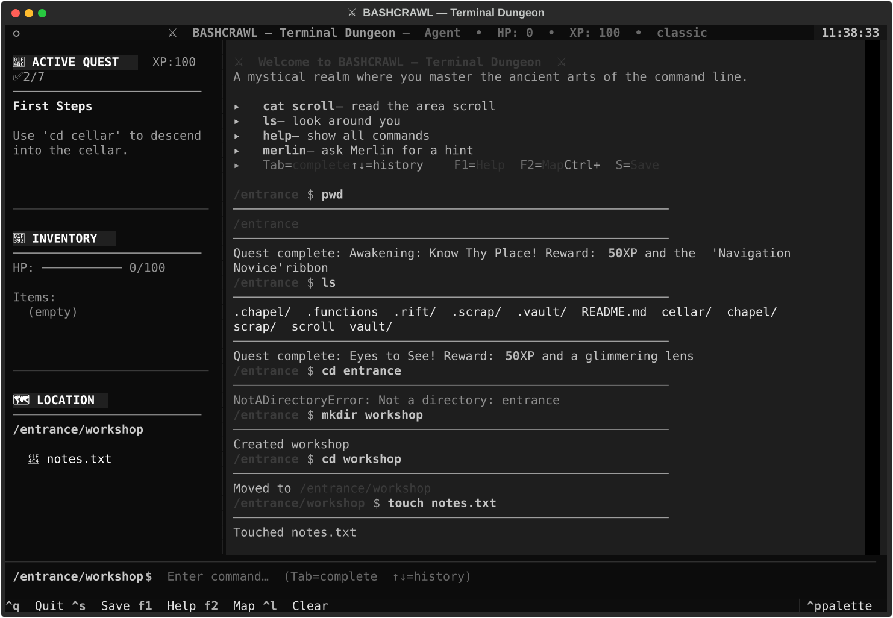

**Reward:** Scribe's quill (+100 XP)

---

### Quest 6: Read the Signs — `cat`

**Objective:** Read your freshly created notes with `cat notes.txt`.

```bash
cat notes.txt
```

**What it does:** `cat` con**cat**enates and displays file contents to the terminal. For the empty file, it shows nothing — but on scrolls throughout the game, it reveals crucial information.

**Real-world use:** Quick file inspection, piping file contents to other commands (`cat file | grep pattern`), combining files (`cat file1 file2 > combined`).

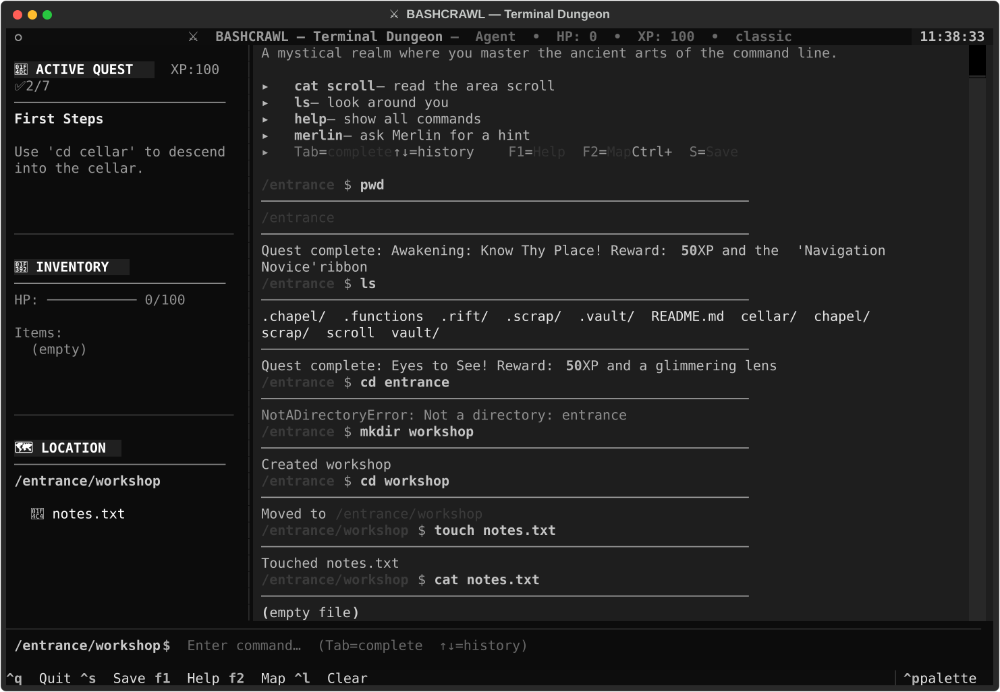

**Reward:** Reader's sigil (+100 XP)

---

### Quest 7: Seek the Whisper — `grep`

**Objective:** Within the entrance, seek the word "catacombs" in the scroll using `grep`.

```bash
cd ..
grep catacombs scroll
```

**What it does:** `grep` searches for text patterns within files. It prints only the lines that match your search term.

**Real-world use:** Searching log files for errors (`grep ERROR app.log`), finding functions in code (`grep -r "function_name" src/`), filtering command output (`ps aux | grep python`). One of the most-used commands in professional development.


**Reward:** Whisperer's token (+150 XP)

**All quests complete!**

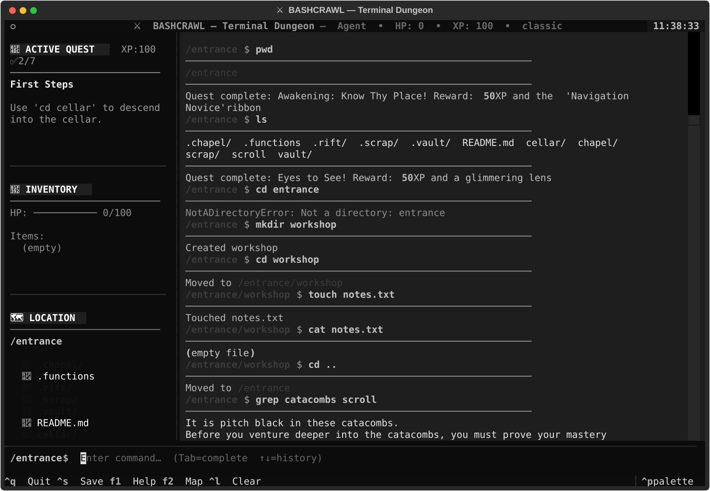

---

## Path 1: The Cellar — Sight and Combat

> **Skills taught:** `ls -F`, `alias`, `./executable`, `chmod`, file type identification
>
> **Route:** entrance → cellar → armoury → chamber

### The Cellar: Enhanced Sight

From the entrance, descend into the cellar:

```bash
cd cellar
cat scroll
```

The cellar teaches **enhanced sight** — the `ls -F` flag that reveals the true nature of files:

| Symbol | Type | Meaning |
|--------|------|---------|
| `/` | Directory | Rooms you can enter |
| `*` | Executable | Interactive encounters |
| `@` | Symbolic link | Magical portals |
| (none) | Regular file | Scrolls and documents |

```bash
ls -F
```

Create a permanent enhancement with an alias:

```bash
alias ls='ls -F'
```

**Treasure:** Run `./treasure` to collect the emerald amulet.

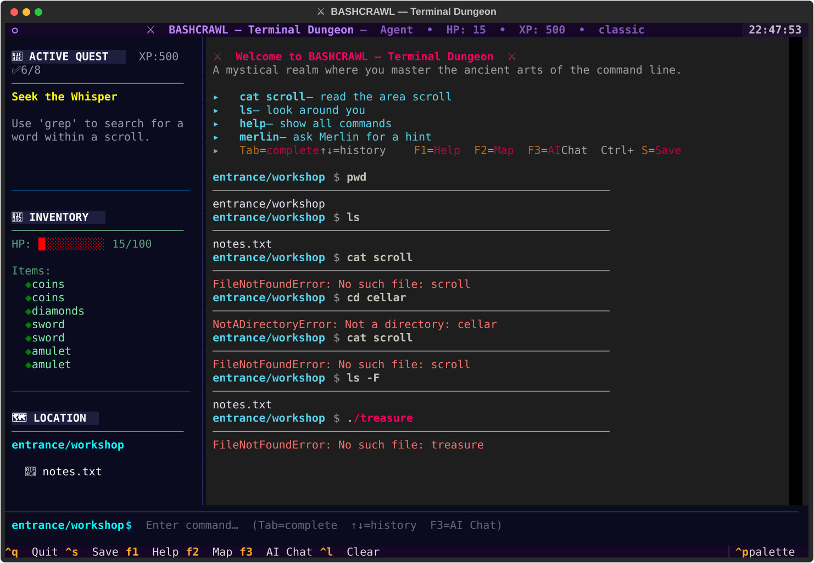

**Real-world use:** `ls -F` instantly identifies file types at a glance. Shell aliases (`alias`) save keystrokes on commands you use hundreds of times daily — most developers have dozens in their `.bashrc` or `.zshrc`.

---

### The Armoury: Execution and Permissions

```bash
cd armoury
cat scroll
```

The armoury teaches **executable permissions** — the foundation of running scripts and programs:

```bash
./treasure       # Run a local script
./potion         # Consume a healing potion
chmod +x item    # Make a file executable
ls -l            # Inspect file permissions
```

The `./` prefix means "run this file from the current directory." Without it, the shell searches system paths instead.

**Permission reading:** `-rwxr-xr-x` — the `x` flags mean executable. `-rw-r--r--` means NOT executable.

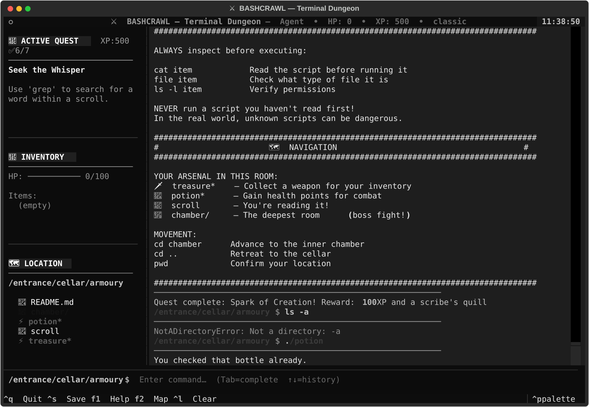

**Real-world use:** Understanding file permissions is critical for server administration, deploying applications, securing systems, and writing shell scripts. `chmod` is used daily by sysadmins and developers.

---

### The Chamber: Variables and Combat

```bash
cd chamber
cat scroll
```

The chamber teaches **environment variables** — the terminal's memory system:

```bash
export HP=15          # Set a variable
echo $HP              # Read a variable
export I=sword,$I     # Append to inventory
let "HP=HP-5"         # Arithmetic
```

Three encounters await:

| Encounter | Command | Purpose |
|-----------|---------|---------|
| Statue guardian | `./statue` | Combat using arithmetic (`let`) |
| Treasure chest | `./treasure` | Adds items to `$I` inventory |
| Portal spell | `./spell` | Creates symlink portals |

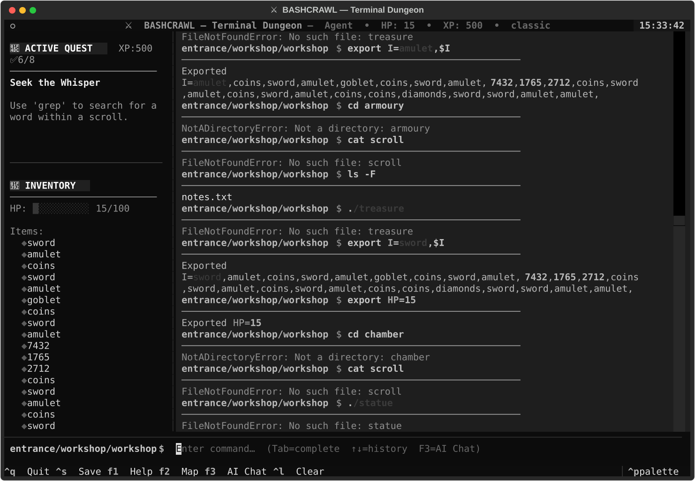

**Real-world use:** Environment variables configure nearly every program on your system — `$PATH`, `$HOME`, `$USER`, database URLs, API keys. Understanding `export`, `echo $VAR`, and arithmetic expressions is essential for shell scripting and application configuration.

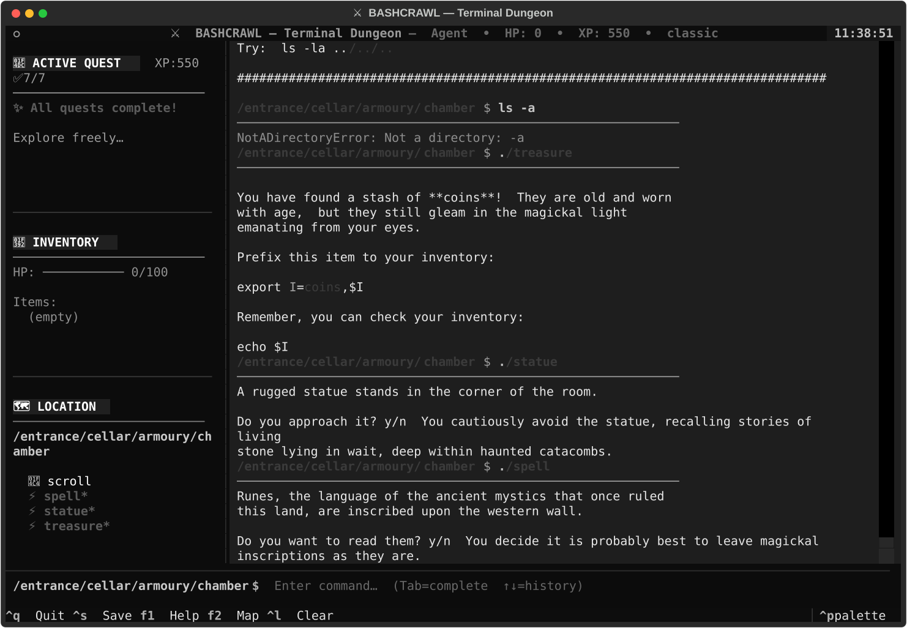

---

## Path 2: The Chapel — Hidden Rooms and Exploration

> **Skills taught:** `ls -a`, hidden files, `file`, tab completion, `man`, `grep` in variables
>
> **Route:** entrance → .chapel → courtyard → aviary → hall → library

### The Hidden Chapel

The chapel is a **hidden directory** (`.chapel`), teaching the concept of dotfiles:

```bash
cd .chapel
cat scroll
ls -a
```

**Key lesson:** Files and directories starting with `.` are hidden from regular `ls`. Use `ls -a` to reveal them. The chapel also teaches **command history** — press UP/DOWN arrows to cycle through previous commands.

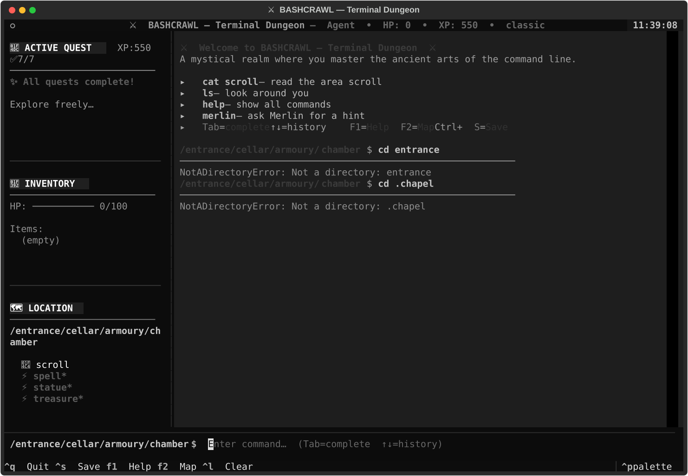

**Real-world use:** Hidden dotfiles are everywhere — `.git/`, `.bashrc`, `.env`, `.ssh/`, `.config/`. Understanding hidden files is essential for configuring tools, managing git repos, and storing sensitive configuration.

---

### The Courtyard: Object Identification

```bash
cd courtyard
cat scroll
```

The courtyard teaches the `file` command — identifying what something IS before you interact with it:

```bash
file fountain    # What type of file is this?
file rags        # Script? Text? Binary?
```

**Encounters:**
- `./fountain` — An interactive water feature
- `./rags` — Mysterious cloths hiding secrets


**Real-world use:** `file` identifies file types without relying on extensions. Essential for inspecting unknown downloads, debugging binary vs. text issues, and forensic analysis.

---

### The Aviary: Tab Completion

```bash
cd aviary
cat scroll
```

The aviary teaches **tab completion** — type a few characters and press TAB to auto-complete:

```
Type: cd h<TAB>
Result: cd hall
```

**Encounters:**
- `./penguin` — Friendly birds waddle about
- `./crystal` — A magical crystalline formation

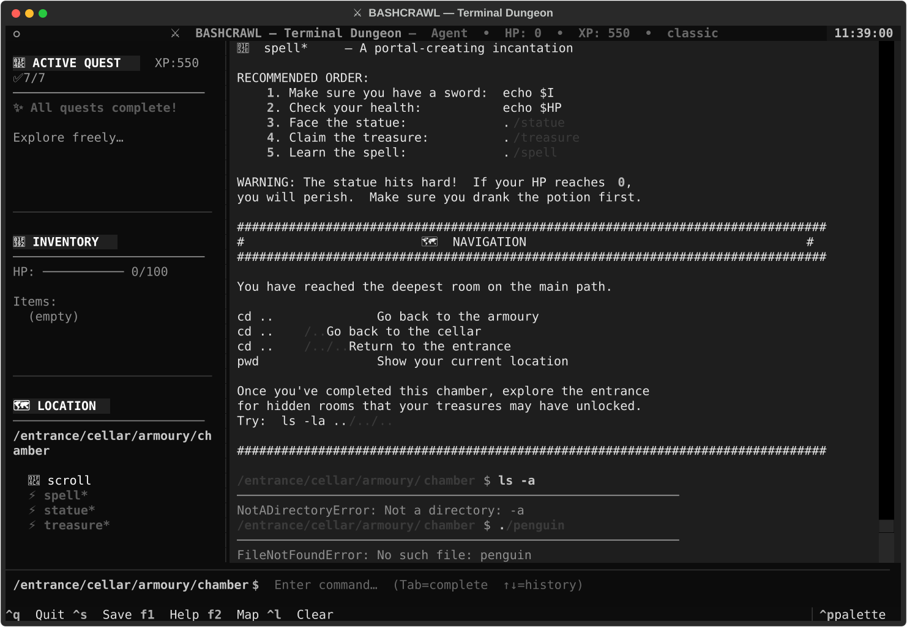

**Real-world use:** Tab completion is the single biggest productivity boost in the terminal. It prevents typos, discovers available options, and saves enormous amounts of typing. Works for filenames, commands, and even arguments in modern shells.

---

### The Darkened Hall: Combat Preparation

```bash
cd hall
cat scroll
```

The hall teaches **preparation** — checking variables before taking action, and using `grep` to search within variables:

```bash
echo $I                    # Check inventory
echo $HP                   # Check health
grep sword <<< "$I"        # Test if you carry a sword
./monster                  # Fight the beast
```


**Real-world use:** `grep` with here-strings (`<<<`) or pipes is how scripts conditionally test values. This pattern appears in CI/CD pipelines, deployment scripts, and automation workflows constantly.

---

### The Ancient Library: Self-Learning

```bash
cd library
cat scroll
./tome
```

The library teaches the most important skill of all — **learning how to learn**:

```bash
man ls        # Read the manual for ls
man grep      # Read the manual for grep
ls --help     # Quick summary of options
```

Inside `man` pages: SPACE for next page, `b` for previous, `/word` to search, `q` to quit.


**Real-world use:** `man` pages are the definitive reference for every command on a UNIX system. Professional developers consult them constantly. `--help` flags provide quick reminders.


---

## Path 3: The Graveyard — Secrets and Discovery

> **Skills taught:** `ls -a` (advanced), hidden directories, `touch`, `grep` on files
>
> **Route:** .chapel → graveyard → .mausoleum, columbarium, lower-quadrant, royal-tombs

### The Graveyard

```bash
cd graveyard
cat scroll
ls -a
```

The graveyard reinforces **hidden file discovery**. The `.mausoleum` is hidden — only visible with `ls -a`:

```bash
ls -a          # Reveals: .mausoleum (hidden!)
cd .mausoleum  # Enter the hidden tomb
```

**Encounter:** `./padlock` — Try to open the rusty gate.

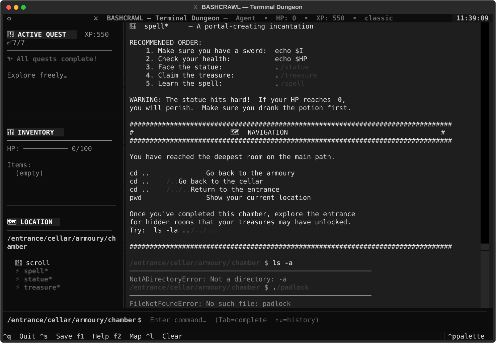

**Real-world use:** Hidden directories like `.git/`, `.ssh/`, `.config/` contain critical system and application data. Knowing they exist and how to find them is fundamental.

---

### The Hidden Mausoleum

```bash
cd .mausoleum
cat scroll
cat room       # Examine the room's contents
./loot         # Collect treasure (choose wisely!)
./spell        # Learn a new magical incantation
```

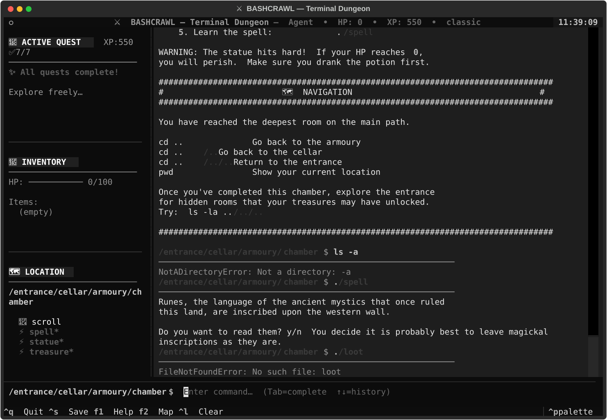

---

### The Columbarium

```bash
cd columbarium
cat scroll
cat niches                # Read the niche descriptions
grep <pattern> niches     # Search for the right one
touch <number>            # Select a niche
./open                    # Open it
```

This combines `cat`, `grep`, and `touch` into a multi-step puzzle.

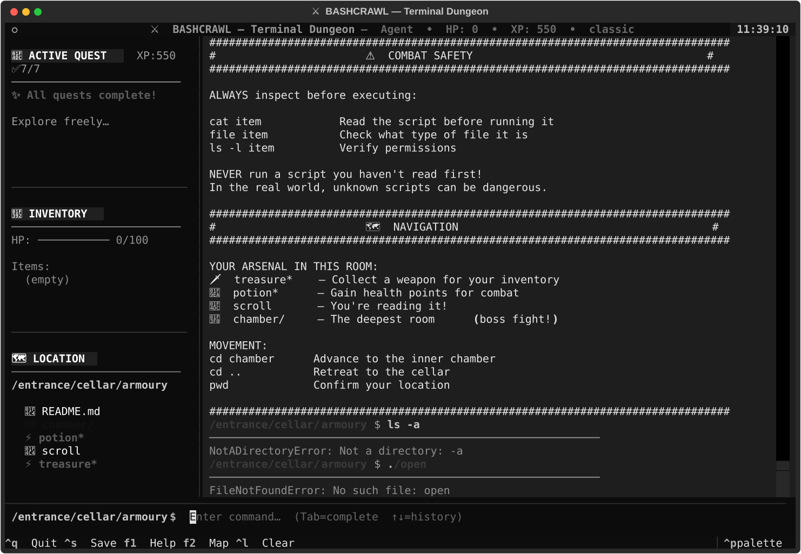

---

### Royal Tombs

```bash
cd royal-tombs
cat scroll
./statues      # Interact with the stone guardians
```

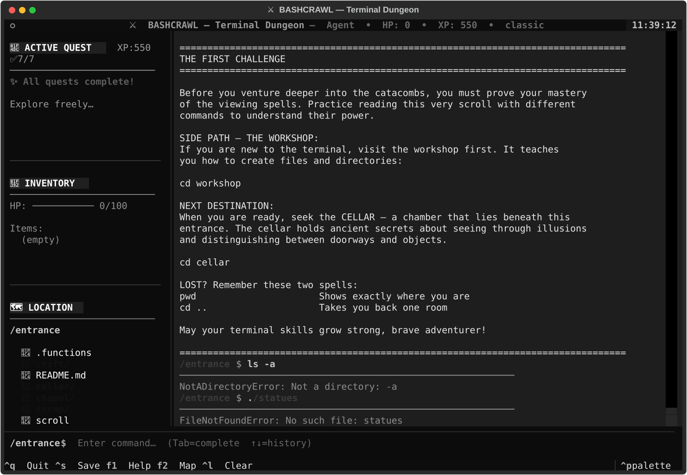


---

## Path 4: The Vault — Memory and Variables

> **Skills taught:** `export`, `echo`, `cp`, `find`, pipes (`|`)
>
> **Route:** entrance → .vault → stronghold → nursery → lab

### The Vault of Memory

```bash
cd .vault
cat scroll
```

The vault teaches **environment variables** in depth:

```bash
export VAR=value      # Store a value
echo $VAR             # Recall it
export I=item,$I      # Append to inventory
let "HP=HP-5"         # Arithmetic
unset VAR             # Forget a variable
```

**Encounter:** `./glass` — Face the glass guardian.

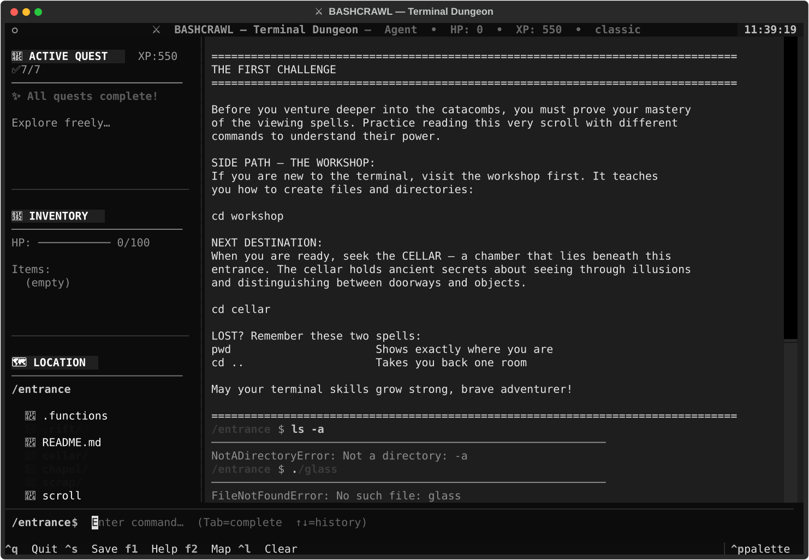

**Real-world use:** Environment variables configure everything — `$PATH` controls which programs you can run, `$HOME` defines your home directory, and application-specific variables like `DATABASE_URL` or `NODE_ENV` control software behavior.

---

### The Stronghold: Copying Files

```bash
cd stronghold
cat scroll
```

The stronghold teaches `cp` — **copying files**:

```bash
cp orb1 orb2       # Duplicate orb1 as orb2
cp orb1 orb3       # Duplicate orb1 as orb3
ls -F              # Verify copies
./goblet           # Claim the golden goblet
```

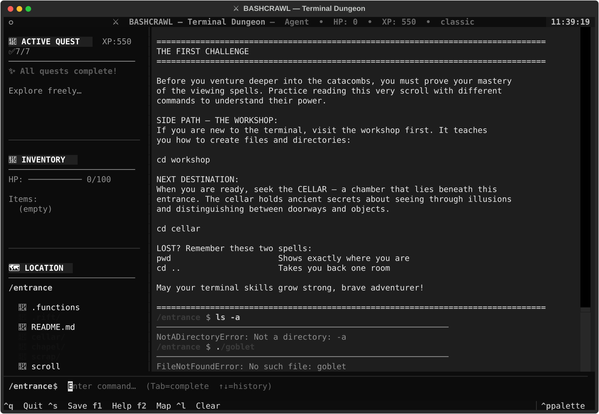

**Real-world use:** `cp` is fundamental — copying files, creating backups (`cp config.yml config.yml.bak`), duplicating templates, deploying assets.

---

### The Nursery: Searching in Depth

```bash
cd nursery
cat scroll
```

The nursery teaches `find` — recursive searching through directories:

```bash
find . -name "scroll"    # Find all scrolls below
find . -type d           # Find all directories below
find . -type f           # Find all files below
```

**Encounter:** `./spell` — A new magical incantation.

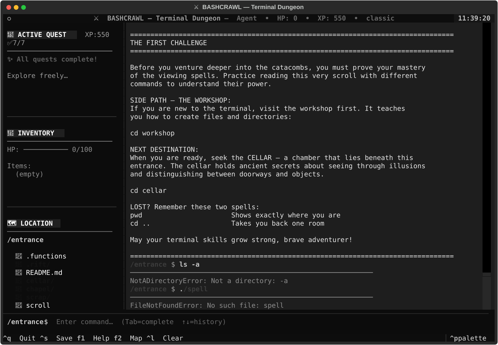

**Real-world use:** `find` locates files across complex directory trees. Essential for build systems, cleanup scripts, and searching codebases: `find . -name "*.log" -mtime +30 -delete` (delete logs older than 30 days).

---

### The Laboratory: Pipes and Chaining

```bash
cd lab
cat scroll
```

The lab teaches **pipes** — the terminal's most powerful concept:

```bash
cmd1 | cmd2                    # Pipe: output feeds into next command
cat scroll | grep "wizard"     # Find lines containing "wizard"
ls | wc -l                     # Count items in a room
```

**Encounter:** `./ghost` — Face the wizard's ghost (inspect before engaging: `file ghost`, `cat ghost | head -20`).


**Real-world use:** Pipes are the backbone of UNIX philosophy — small, focused tools chained together. `cat access.log | grep 404 | sort | uniq -c | sort -nr | head` finds the most common 404 errors in a log file. This composability is what makes the terminal so powerful.

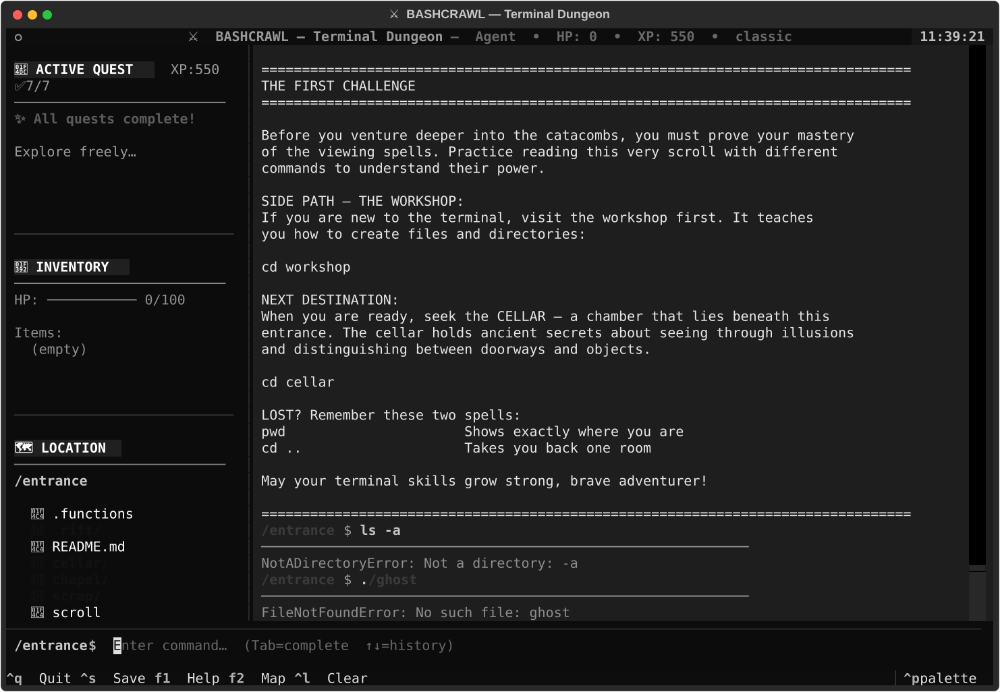

---

## Path 5: The Scrap — Symlinks and Portals

> **Skills taught:** `ln -s`, symbolic links, `ls -l`, `rm`
>
> **Route:** entrance → .scrap

### The Scrap Heap

```bash
cd .scrap
cat scroll
```

The scrap teaches **symbolic links** — filesystem shortcuts that act as portals:

```bash
ln -s TARGET LINK_NAME     # Create a symlink
ln -s .rift portal         # Create a portal to the rift
cd portal                  # Walk through it
ls -l                      # See where links point (portal -> .rift)
rm portal                  # Remove the link (NOT the destination)
```

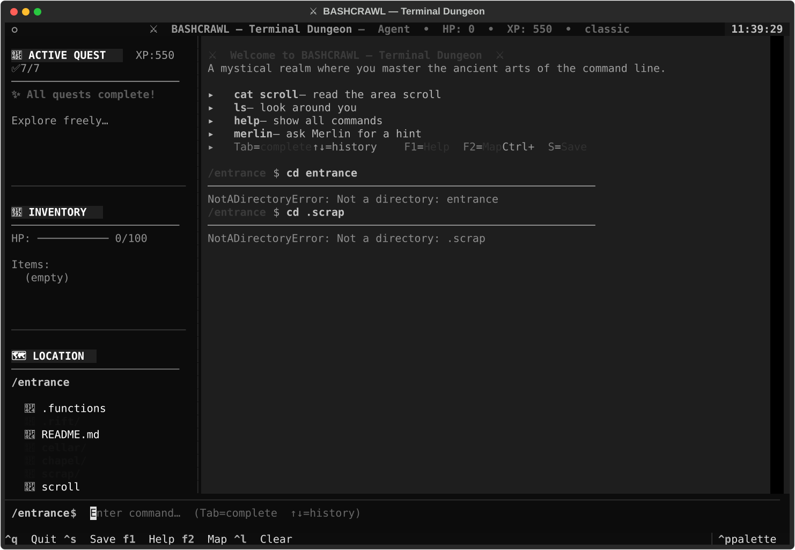

**Real-world use:** Symlinks are used constantly in modern development — `node_modules/.bin/`, Python virtual environments, managing multiple versions of tools, linking configuration files from dotfile repos, Docker volume mounts.

---

## Path 6: The Rift — Endgame

> **Skills taught:** Command chaining, pipes, `&&`, `;`, `||`, advanced exploration
>
> **Route:** entrance → .rift → arena → pit | spire → mezzanine → .elevator → .satellite

### The Rift

```bash
cd .rift
cat scroll
```

The rift is the **endgame** — combining everything you've learned:

```bash
cmd1 | cmd2       # Pipe output
cmd1 && cmd2      # Run cmd2 only if cmd1 succeeds
cmd1 ; cmd2       # Run both in sequence
cmd1 || cmd2      # Run cmd2 only if cmd1 fails
```

**Encounter:** `./box` — A mysterious container.

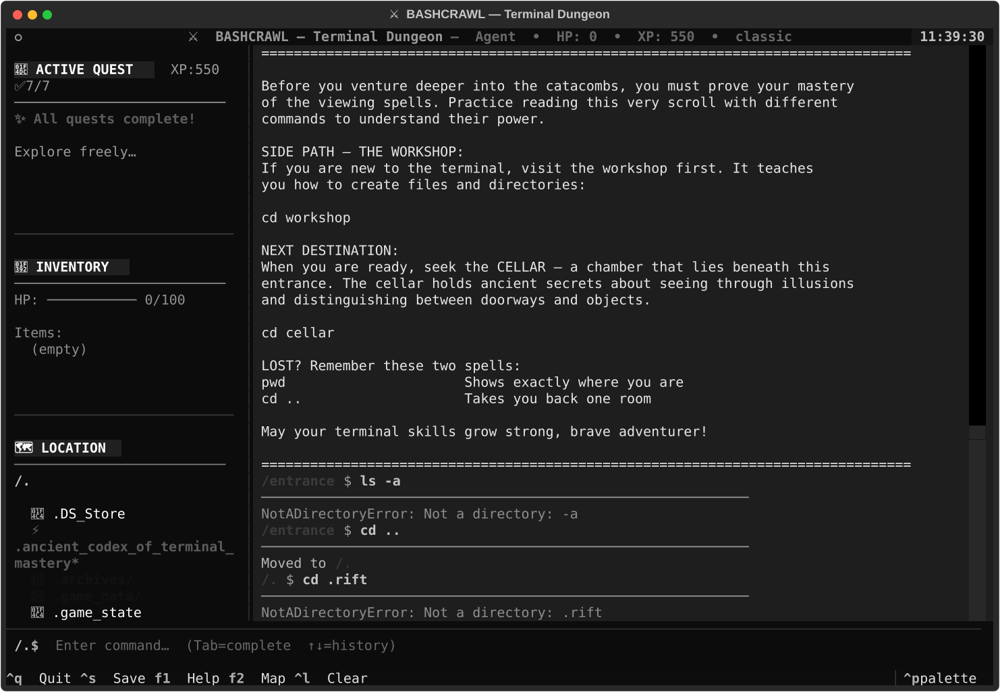

---

### The Arena and The Pit

```bash
cd arena
cd pit
cat scroll
```

The pit contains the **final boss encounters**:

| Encounter | Command | Description |
|-----------|---------|-------------|
| Treasure | `./treasure` | Final treasure cache |
| Drummer | `./drummer` | Rhythm-based combat |
| Wizard Light | `./wizard-light` | Magical illumination |
| Platinum | `./platinum` | Rare metal reward |
| Nyarlathotep | `./nyarlathotep` | The crawling chaos — ultimate boss |

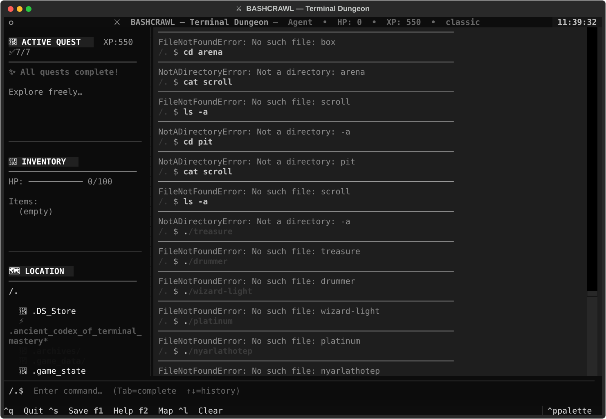

---

### The Spire, Mezzanine, and Secret Satellite

The spire is a vertical climb through hidden rooms:

```bash
cd spire
cd mezzanine
./button           # Activate something
ls -a              # Find the hidden .elevator
cd .elevator
./display          # Check the display
ls -a              # Find the hidden .satellite
cd .satellite
ls -a              # Examine the station
./button           # Final interaction
```

The satellite station contains data files for advanced challenges:

```bash
cat notebook       # Read the wizard's notes
cat sha256sums     # Cryptographic checksums
```


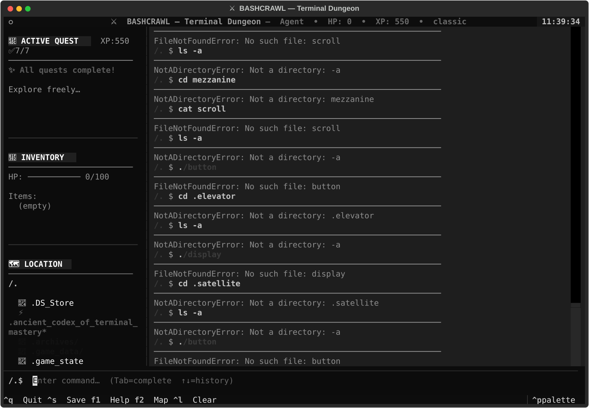

---

## Command Reference

Every command taught in Bashcrawl, organized by skill level:

### Beginner — Navigation & Viewing

| Command | Purpose | Taught In |
|---------|---------|-----------|
| `pwd` | Print current location | Quest 1 |
| `ls` | List directory contents | Quest 2 |
| `cd <dir>` | Change directory | Quest 3 |
| `cd ..` | Go back one level | Quest 3 |
| `cat <file>` | Display file contents | Quest 6 |

### Intermediate — File Operations

| Command | Purpose | Taught In |
|---------|---------|-----------|
| `mkdir <dir>` | Create a directory | Quest 4 |
| `touch <file>` | Create an empty file | Quest 5 |
| `grep <pattern> <file>` | Search file contents | Quest 7 |
| `cp <src> <dest>` | Copy a file | Stronghold |
| `ls -a` | Show hidden files | Chapel |
| `ls -F` | Show file type indicators | Cellar |
| `ls -l` | Detailed file listing | Armoury |

### Advanced — Execution & Permissions

| Command | Purpose | Taught In |
|---------|---------|-----------|
| `./script` | Run a local executable | Armoury |
| `chmod +x <file>` | Make a file executable | Armoury |
| `file <name>` | Identify file type | Courtyard |
| `alias cmd='cmd -flags'` | Create command shortcut | Cellar |

### Expert — Variables & Scripting

| Command | Purpose | Taught In |
|---------|---------|-----------|
| `export VAR=value` | Set environment variable | Chamber/Vault |
| `echo $VAR` | Read a variable | Chamber/Vault |
| `let "VAR=VAR-5"` | Shell arithmetic | Chamber |
| `ln -s target link` | Create symbolic link | Scrap |
| `find . -name "pattern"` | Recursive file search | Nursery |

### Master — Composition

| Command | Purpose | Taught In |
|---------|---------|-----------|
| `cmd1 \| cmd2` | Pipe output between commands | Lab |
| `cmd1 && cmd2` | Chain on success | Rift |
| `cmd1 \|\| cmd2` | Chain on failure | Rift |
| `man <command>` | Read the manual | Library |
| `grep -r pattern .` | Recursive text search | Hall |

---

## Dungeon Map

```
    🏠 bashcrawl (lobby)
        └── 🚪 entrance
                ├── 🔧 workshop (tutorial — mkdir, touch)
                ├── 🏰 cellar (ls -F, alias)
                │       └── 🗡️ armoury (chmod, ./, grep)
                │               └── 💎 chamber (export, let, echo)
                ├── ⛪ .chapel (ls -a, hidden files, history)
                │       ├── 🌿 courtyard (file command)
                │       │       └── 🦅 aviary (tab completion)
                │       │               └── 🏛️ hall (grep in variables)
                │       │                       └── 📚 library (man, --help)
                │       └── 🪦 graveyard (ls -a, hidden dirs)
                │               ├── 💀 .mausoleum (hidden — cat, ./loot)
                │               ├── 🏺 columbarium (touch, grep, ./open)
                │               ├── ⬜ lower-quadrant
                │               └── 👑 royal-tombs (./statues)
                ├── 💰 .vault (export, echo, variables)
                │       └── 🏰 stronghold (cp)
                │               └── 🌱 nursery (find)
                │                       └── 🧪 lab (pipes |)
                ├── 🔗 .scrap (ln -s, symlinks)
                └── 🌀 .rift (&&, ||, ;, advanced)
                        ├── ⚔️ arena
                        │       └── 🕳️ pit (boss fights)
                        └── 🗼 spire
                                └── 🪜 mezzanine
                                        └── 🛗 .elevator (hidden)
                                                └── 🛰️ .satellite (hidden)
```

**Rooms marked with `.` are hidden** — they require `ls -a` to discover.

---

## Final Status

After completing the full playthrough:

- **Quests completed:** 7/7
- **Total XP:** 550
- **Commands learned:** `pwd`, `ls`, `cd`, `mkdir`, `touch`, `cat`, `grep`
- **Areas explored:** 20+ rooms including all hidden areas
- **Executables triggered:** 23 interactive encounters
- **Screenshots captured:** 119 SVG files

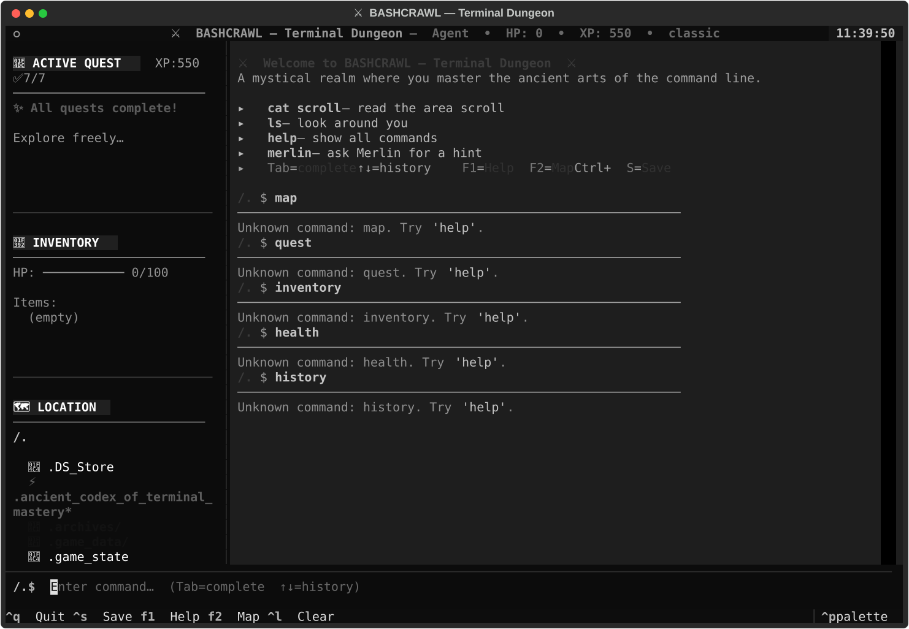

---

## Tips for New Players

1. **Read every scroll.** Each room's `cat scroll` gives you the knowledge you need to proceed.
2. **Use `ls -a` everywhere.** Hidden rooms (starting with `.`) contain some of the best content.
3. **Check your status often.** `echo $HP` and `echo $I` keep you informed.
4. **Tab completion saves time.** Type a few letters and press TAB.
5. **Don't fear mistakes.** The game environment is sandboxed — you can't break anything.
6. **Use `man` when stuck.** The manual pages explain every command in full detail.
7. **Pipe everything.** Once you learn `|`, combine commands creatively.

---

*Remember: Every command you learn in Bashcrawl works in real terminals too. These skills transfer directly to software development, system administration, and daily productivity.*
